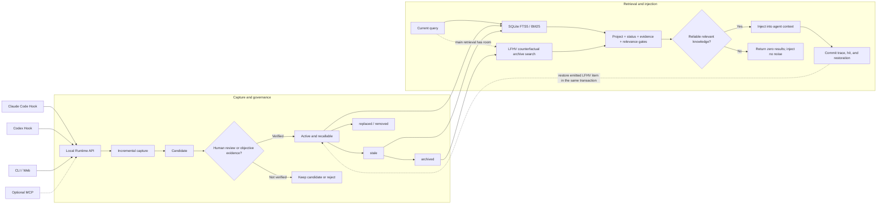

# MemWeave

[简体中文](https://github.com/zzOwOzzZoww/MemWeave/blob/main/README.md) | **English**

MemWeave is a local shared-memory layer for coding agents.

It lets agents such as Claude Code and Codex reuse confirmed project knowledge: technical decisions, user preferences, lessons learned, and working agreements. It does not treat every conversation as permanent memory, and it does not inject loosely related content just to make recall numbers look better.

**In one sentence: MemWeave is not about whether an agent can remember; it is about how existing coding agents share verified, traceable project knowledge while making forgetting testable and reversible.**

> Current version: 0.5.0a1 (Alpha). The core loop is working and ready for evaluation in test projects.
>
> **Core loop: capture candidates across agents → promote with evidence → recall only when relevant → retire safely → use LFHV to test whether retirement was premature.**

## What problem does it solve?

Switching between coding agents often creates the same problems:

- Codex learns a project rule, but Claude Code has to ask again.
- An old decision has been replaced, but an agent still uses it.
- A casual statement becomes “permanent truth” and keeps affecting later work.
- A recall system injects vaguely similar notes even when they are not useful.
- Long-term memory grows without bound if nothing leaves, but ordinary archival cannot tell whether useful knowledge was retired too early.

MemWeave focuses on a small, complete loop:

1. After an agent finishes a turn, it extracts only possible knowledge candidates.
2. A candidate becomes usable only after human approval or objective evidence.
3. A new task receives only knowledge relevant to the current project and query.
4. Old knowledge can be archived, quarantined, replaced, or deleted; LFHV counterfactually checks whether archival was premature and restores a record only after it is actually emitted again.

## Core difference: a closed memory-governance loop

- **It does not replace the agent runtime**: Claude Code and Codex keep working normally; hooks and the local Runtime add shared memory and governance around them.
- **Evidence comes before cross-agent sharing**: new knowledge starts as a candidate and becomes active only after human approval or objective evidence.
- **Zero recall is better than noisy recall**: retrieval checks project scope, lifecycle state, version, evidence, and query relevance, and returns nothing when no result is trustworthy.
- **LFHV makes forgetting falsifiable**: LFHV (Lost Future Hit Value) asks whether a record was archived too early. A later query may rediscover archived knowledge, but restoration happens only when the record is actually emitted into the current context. This keeps active memory bounded without making useful knowledge permanently unreachable.

## How is it different from Mem0 and Letta?

The projects overlap, but they operate at different layers rather than fully replacing one another:

- **[Mem0](https://github.com/mem0ai/mem0)** is closer to a general-purpose memory service. Applications call add/search to store and retrieve memories for assistants, personalization, and other AI products.
- **[Letta / MemGPT](https://github.com/letta-ai/letta)** is closer to a complete stateful agent runtime. It manages the agent loop, context window, and memory blocks inside its own framework.
- **MemWeave** is a local governance layer outside existing coding agents. Claude Code, Codex, and other tools keep their normal runtime and connect through hooks or the Runtime API. New knowledge starts as a candidate, becomes active only after human approval or objective evidence, and uses LFHV to test whether archived knowledge was retired too early while preserving its project, source agent, source session, and evidence trail.

As a rough guide: consider Mem0 for general application memory, Letta when building a persistent agent runtime from scratch, and MemWeave when existing coding agents need to share verified project knowledge without allowing incorrect, stale, or cross-project memories to spread silently.

## Design principles

- **Local first**: the knowledge database and Runtime run locally by default.
- **Candidate before active**: new knowledge starts as candidate and cannot silently pollute long-term memory.
- **Zero recall is normal**: when nothing is relevant, MemWeave returns nothing.
- **Core does not depend on MCP**: agents connect through native hooks or the Runtime API; MCP is optional.
- **Context stays attached**: project scope, source agent, source session, and evidence references are preserved.
- **Sensitive data does not belong in memory**: do not store passwords, tokens, raw private conversations, or unverified guesses.

## Architecture and data flow

The retrieval hot path does not call a model. It starts with SQLite FTS5/BM25, then applies limited bilingual term bridges, topic expansion, and evidence gates. MemWeave is not trying to be a general-purpose semantic search engine; it is designed to keep a focused knowledge-governance loop explainable and auditable.

## LFHV: making forgetting testable

MemWeave defines **LFHV** as **Lost Future Hit Value**: the future retrieval value that may be lost after knowledge leaves the active set. Long-term memory cannot grow forever, but an archive decision can be premature, so retirement needs its own counterfactual check.

In plain language:

1. `active` and `stale` records participate in normal recall; `archived` records do not enter context by default.
2. When a query arrives and normal recall leaves room, LFHV separately checks relevant archived knowledge.
3. An archived record must pass project, version, evidence, query-relevance, and context-budget checks again.
4. Only a record actually selected and emitted into the current context is restored to `active`, in the same transaction as its reuse trace and hit accounting. A record that does not fit the outgoing context remains archived.

This lets MemWeave shrink the active memory set without treating archival as irreversible forgetting. An LFHV shadow hit only means that archived knowledge became relevant again; it does not by itself prove better task outcomes. Quarantined, superseded, or evidence-invalid records cannot use LFHV as a route back into context.

## Public benchmark

As of 2026-09-29, the current code was evaluated on 1,986 questions from the public **LoCoMo** long-term conversational-memory benchmark. The run used session-level Top-5 evidence retrieval and did not call a model:

| Metric | Result |
| --- | ---: |
| Hit@5 | **88.32%** |
| MRR | **73.14%** |
| P95 retrieval latency | **13.79 ms** |

Hit@5 means that the correct evidence session appeared in the Top-5 retrieved results. **These numbers describe the retrieval layer only. They are not final-answer accuracy, real-agent task success, or a safety score.** The evaluation script is available at [scripts/evaluate_locomo_retrieval.py](https://github.com/zzOwOzzZoww/MemWeave/blob/main/scripts/evaluate_locomo_retrieval.py).

### Noise-control comparison: Naive FTS Top-K vs MemWeave

To measure what the governance layer actually changes, we froze development on the `dev` split and ran the 300 held-out `test` cases from the bundled synthetic cross-agent benchmark. The baseline uses the same SQLite FTS5/BM25 engine and query tokenization, but disables project, lifecycle, evidence, supersession, same-session, and minimum-relevance gates; any lexical match can enter the Top-3.

| Metric | Naive FTS Top-3 | MemWeave |
| --- | ---: | ---: |
| Decision accuracy | 54.00% | **77.33%** |
| Positive evidence recall | **64.00%** | 54.67% |
| Negative-case injection rate | 69.33% | **0.00%** |
| Forbidden-evidence injection rate | 50.00% | **0.00%** |
| Unnecessary context records | 180 | **0** |
| Unnecessary context volume | 16,380 UTF-8 bytes | **0 bytes** |

The result shows a deliberate conservative trade-off: on these controlled cases, MemWeave eliminated irrelevant injection and unnecessary context, while losing some positive recall. UTF-8 bytes are a deterministic context-volume measure, not tokens from a particular model tokenizer. The benchmark makes no model calls and does not measure answer accuracy, real task success, or safety. See the [full report](evaluation/memweave-cross-agent-v1/noise-comparison-test-20260929.json) and [reproduction script](evaluation/memweave-cross-agent-v1/compare_naive_fts.py).

## Quick start

Python 3.11 or newer is required.

### Install directly from GitHub

~~~shell
python -m pip install "git+https://github.com/zzOwOzzZoww/MemWeave.git"
memweave setup
~~~

### Install from source (for developers)

~~~shell
git clone https://github.com/zzOwOzzZoww/MemWeave.git
cd MemWeave
python -m pip install -e .
memweave setup
~~~

setup asks for the model provider Base URL, model name, and API key. The model is used only for background knowledge extraction. Normal recall does not read credentials or call a model.

On Windows, setup creates a “MemWeave Knowledge Manager” desktop shortcut. On macOS and Linux, use memweave ui; desktop shortcut behavior has only been validated on Windows so far.

## Common commands

~~~shell
memweave                     # configure on first run, then open the management UI
memweave ui                  # start the Runtime and open the UI
memweave status              # inspect agents, knowledge, and learning jobs
memweave configure           # update model API settings without deleting knowledge
memweave doctor              # check local configuration and runtime health
memweave doctor --check-api  # send a small API request; this may have a small cost
memweave shortcut            # repair the Windows desktop shortcut
~~~

Use “Agent Maintenance” in the management UI to enable Claude Code or Codex. This installs the corresponding global hook, and the client may need to be restarted afterward.

## When does knowledge become active?

MemWeave does not treat “the model said it” as proof. Common states include:

- **candidate**: newly extracted and waiting for review.
- **active**: approved or verified and available for recall.
- **archived**: kept for history but normally excluded from recall.
- **quarantined**: risky or expired during review and excluded by default.

When a clear preference or decision changes, the UI can show the conflict between old and new versions. After replacement is confirmed, the new version becomes active and the old one remains only for history. Complex, conditional, or ambiguous statements still require human judgment.

## Data and privacy

The default data directory is ~/.memweave. It contains configuration, the SQLite database, runtime state, and logs. Set MEMWEAVE_HOME to use another location.

Background extraction sends a redacted conversation summary to the model provider you configure. Redaction cannot cover every custom credential format, so do not connect conversations that must never leave the machine to a remote provider.

API keys are not stored in the knowledge database. Windows uses per-user DPAPI encryption. Other systems currently store the key in a separate file with 0600 permissions, without additional encryption.

## Development and tests

~~~shell
python -m pip install -e ".[test]"
python -m pytest tests -q
python -m pip wheel . --no-deps --wheel-dir dist
~~~

As of 2026-09-29, the full suite reports **408 passed, 9 subtests passed**, with CI coverage on Windows, Ubuntu, Python 3.11, and Python 3.12. These results validate the fixed test suites only; they are not claims about open-domain understanding, real-agent task success, or production-scale performance.

Project layout:

~~~text
src/agent_knowledge_bridge/        Core, Runtime, CLI, and management UI
src/agent_knowledge_bridge/hooks/  Native Claude Code and Codex hooks
scripts/                           Development, installation, and evaluation tools
tests/                             Regression and product-installation tests
docs/                              Design notes and historical validation records
evaluation/                        Candidate synthetic evaluation dataset
~~~

## Current limits

- This is an Alpha release and has not been validated across every OS and client version.
- The bilingual term bridge is a small, auditable rule set, not a universal language model.
- Synthetic evaluations test closed-loop behavior; they do not represent real conversations or real tasks.

This project is licensed under the [Apache License 2.0](https://github.com/zzOwOzzZoww/MemWeave/blob/main/LICENSE).

See [docs/](https://github.com/zzOwOzzZoww/MemWeave/tree/main/docs) for detailed design and validation notes.
