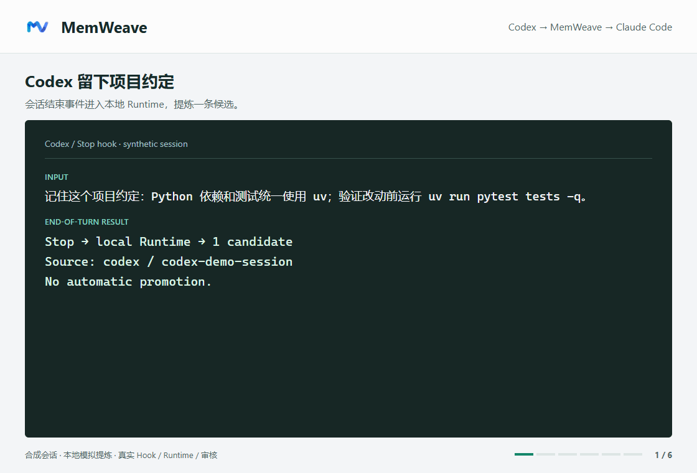
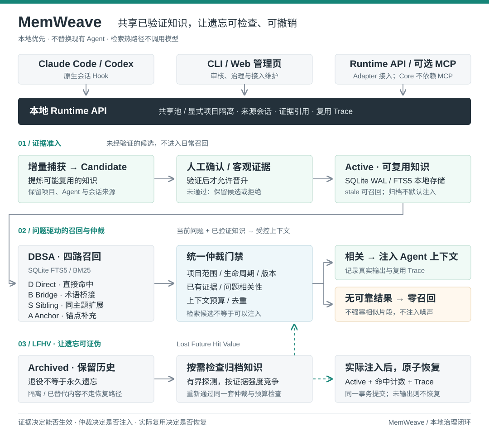

# MemWeave（织忆）

**简体中文** | [English](https://github.com/zzOwOzzZoww/MemWeave/blob/main/README.en.md)

MemWeave 是一个给 Coding Agent 用的本地共享记忆层。

它让 Claude Code、Codex 等 Agent 在同一个项目里复用已经确认过的知识，比如技术决策、用户偏好、踩坑经验和项目约定。它不会把所有对话都当成“记忆”，也不会为了看起来聪明而硬塞不相关内容。

**一句话定位：MemWeave 解决的不是“Agent 有没有记忆”，而是“多个现有 Coding Agent 如何共享经过验证、可追溯的项目知识，并让遗忘可以被检查和撤销”。**

> 当前版本：0.5.0a1（Alpha）。核心闭环已经可以运行，适合在测试项目中体验和验证。
>
> **核心闭环：跨 Agent 捕获候选 → 证据晋升 → 相关才召回 → 安全归档 → LFHV 检查是否退役过早。**

## 半分钟演示：换 Agent，不重讲项目约定

Codex 留下“使用 `uv` 管理依赖和测试”的项目约定。审核前 Claude Code 拿不到这条候选，批准后自动召回；换成天气问题，仍然不注入。

演示使用隔离数据库、合成会话和本地模拟提炼组件，实际执行原生 Hook、Runtime、管理页审核与上下文注入。画面里的召回结果是 Hook 输出节选，不是模型回答，也不代表真实 Agent 任务成功率。

复现这段演示（不使用真实凭据或付费模型）

需要 Python 3.11+ 和 Node.js。在仓库根目录运行：

~~~bash
python -m pip install -e ".[runtime]" pillow
npm install --prefix outputs/readme-demo-tools --no-save --package-lock=false playwright
node outputs/readme-demo-tools/node_modules/playwright/cli.js install chromium
python scripts/record_readme_demo.py --output outputs/readme-demo --node-modules outputs/readme-demo-tools/node_modules
~~~

GIF、逐帧截图、完整 Hook 输出和断言报告写入 `outputs/readme-demo`。脚本不改本机 Agent 配置或已有知识库；录制源码见 [record_readme_demo.py](scripts/record_readme_demo.py)。

## 它解决什么问题

平时在多个 Agent 之间切换，经常会遇到这些情况：

- Codex 刚弄清楚的项目约定，Claude Code 又要重新问一遍。
- 旧方案已经被替换，但 Agent 还在引用过时结论。
- 一段偶然对话被当成长期事实，之后反复干扰任务。
- 为了提高召回率，系统把“有点像”的内容也塞进上下文。
- 长期记忆只进不出会不断膨胀，但直接归档又无法判断一条知识是不是退役得太早。

MemWeave 想做的是一个小而完整的闭环：

1. Agent 结束一轮工作后，只提炼可能值得保留的候选知识。
2. 候选经过人工确认或客观证据验证后，才能成为可用知识。
3. 新任务开始时，只召回当前项目和当前问题真正相关的内容。
4. 旧知识可以归档、隔离、替换或删除；LFHV 会反事实检查归档是否过早，只有真正再次注入上下文时才恢复。

## 核心差异：把记忆治理做成闭环

- **不替换现有 Agent**：Claude Code、Codex 继续按原来的方式工作，MemWeave 通过 Hook 和本地 Runtime 补上共享记忆与治理。
- **先有证据，再跨 Agent 共享**：新知识先进入 candidate，只有人工确认或客观证据通过后才成为 active。
- **宁可零召回，也不强塞噪声**：检索会检查项目范围、状态、版本、证据和问题相关性，没有可靠结果就返回空。
- **LFHV 让遗忘可证伪**：LFHV（Lost Future Hit Value）检查“这条知识是不是归档早了”。后续请求可以重新发现归档知识，但只有它真正进入本轮上下文时才同步恢复，避免活跃记忆只增不减，也避免有价值知识被永久忘掉。

## 和 Mem0、Letta 有什么不同

它们有重叠，但解决的层级不同，不是谁完全替代谁：

- **[Mem0](https://github.com/mem0ai/mem0)** 更像通用记忆服务。应用主动调用 add/search，为聊天机器人、用户画像和通用 AI 应用保存与检索记忆。
- **[Letta / MemGPT](https://github.com/letta-ai/letta)** 更像完整的有状态 Agent Runtime。它负责 Agent 循环、上下文窗口和 memory blocks，让 Agent 在自己的运行框架内管理记忆。
- **MemWeave** 是现有 Coding Agent 外部的本地治理层。Claude Code、Codex 等工具保留原来的运行方式，通过 Hook 或 Runtime API 共享知识；新知识先进入 candidate，经过人工确认或客观证据后才成为 active，并通过 LFHV 检查归档是否过早，保留项目、来源 Agent、来源会话和证据链。

简单来说：做通用应用记忆可以优先看 Mem0；从头构建长期运行的 Agent 可以看 Letta；希望多个现有 Coding Agent 复用经过验证的项目知识，同时控制错误、过期和跨项目记忆，可以使用 MemWeave。

## 设计原则

- **本地优先**：知识库和 Runtime 默认都在本机运行。
- **先候选，后生效**：新知识默认是 candidate，不会直接污染长期记忆。
- **零召回很正常**：没有合适内容时就返回空，不强行注入相近话题。
- **Core 不依赖 MCP**：Agent 通过原生 Hook 或 Runtime API 接入；MCP 只是可选入口。
- **保留上下文边界**：项目、来源 Agent、来源会话和证据引用都会记录。
- **不保存敏感信息**：不要持久化密码、Token、原始私人对话或未经验证的猜测。

## 架构与数据流

**DBSA 四路召回**：Direct 直接命中、Bridge 术语桥接、Sibling 同主题扩展、Anchor 锚点补充；所有路径都要通过统一仲裁，检索到不等于可以注入。Direct/Bridge 保留主结果页，Anchor 与最多一条 Sibling 共用有界补充位置，Sibling 不再挤占主结果。

检索热路径不调用模型，主要使用 SQLite FTS5/BM25，再做有限的中英文术语桥接、同主题扩展和证据门禁。它不是通用语义搜索引擎，目标是让固定的知识治理闭环保持可解释、可审计。

## LFHV：让“遗忘”也能被验证

MemWeave 将 **LFHV** 定义为 **Lost Future Hit Value**，也就是“一条知识退出活跃集合后，未来本来还能命中的价值”。长期记忆不能只增不减，但一次归档决定也可能过早，因此淘汰策略需要自己的反事实检查。

大白话流程是：

1. `active` 和 `stale` 参与普通召回，`archived` 默认不会进入上下文。
2. 当前问题到来后，LFHV 会有界检查相关归档知识，不再仅因普通结果数量已满而跳过；当前作用域内没有归档记录时跳过恢复检索。
3. 归档记录必须重新通过项目范围、版本状态、已有证据和问题相关性检查，按证据强度与普通结果共同竞争固定的记录数与字符预算。证据强度相同时普通结果优先；恢复候选失效后，其位置和字符预算会交还给有效普通结果。
4. 只有真正被选中并写入本轮上下文的记录，才会和复用 trace、命中计数一起在同一事务中恢复为 `active`；放不进上下文的记录仍保持归档。

这让 MemWeave 既能缩小长期活跃集合，又不会把归档当成不可撤销的永久遗忘。需要注意：一次 LFHV 影子命中只能说明“这条归档知识又和问题相关”，不能单独证明它提高了最终任务成功率；被隔离、已替代或证据失效的内容也不会借 LFHV 回到上下文。

## 公开评测

截至 2026-09-29，使用当前代码在公开长对话记忆基准 **LoCoMo** 的 1,986 道问答上进行 session 粒度 Top-5 证据检索评测，评测过程不调用模型：

| 指标 | 结果 |
| --- | ---: |
| Hit@5 | **88.58%** |
| MRR | **73.39%** |
| P95 检索延迟 | **14.97 ms** |
| 自定义对抗题空结果率 | **0.00%** |

这里的 Hit@5 表示 Top-5 结果中是否包含正确证据会话。自定义对抗题空结果率来自 454 条被脚本标成“应返回空”的问题，其中包含 LoCoMo Category 5；这些问题仍保留了用于分析的标注证据，而 session 粒度检索只要返回任何相关会话就会被记为非空。因此 **0.00% 不等于最终拒答准确率为 0，也不能当作噪声注入率**，它说明当前检索层还不能单独判断“相关证据是否足以回答”。这些数字都只代表检索层，不是最终回答准确率、真实 Agent 任务成功率或安全性评分。评测脚本位于 [scripts/evaluate_locomo_retrieval.py](https://github.com/zzOwOzzZoww/MemWeave/blob/main/scripts/evaluate_locomo_retrieval.py)。

### 抗噪声效果：Naive FTS Top-K vs MemWeave

为了回答“治理层到底带来了什么”，我们运行了自带跨 Agent 合成基准中的 300 条冻结 `test` 回归案例。对照组使用相同的 SQLite FTS5/BM25 和查询分词，但关闭项目范围、生命周期、证据、版本替代、同会话和最低相关性门禁；只要有词面命中就取 Top-3。

| 指标 | Naive FTS Top-3 | MemWeave |
| --- | ---: | ---: |
| 决策准确率 | 54.33% | **100.00%** |
| 正向证据召回率 | 70.67% | **100.00%** |
| 负例误注入率 | 76.67% | **0.00%** |
| 禁止证据注入率 | 55.67% | **0.00%** |
| 无意义上下文记录数 | 197 | **0** |
| 无意义上下文体积 | 18,103 UTF-8 bytes | **0 bytes** |

`shadow-v1` 下 LFHV 影子候选发现率为 100%；`on-demand-v2` 下同轮恢复率为 100%。本轮已经使用该冻结集的失败簇来修复术语归一化和复合技术问题门禁，因此这里的 100% 是**回归闭环结果，不是独立留出集上的泛化成绩**。字节数是确定性的上下文体积，不等于某个模型 tokenizer 的 Token 数；评测不调用模型，也不代表回答准确率、真实任务成功率或安全性评分。完整报告见 [noise-comparison-test-20260929.json](evaluation/memweave-cross-agent-v1/noise-comparison-test-20260929.json)，复现脚本见 [compare_naive_fts.py](evaluation/memweave-cross-agent-v1/compare_naive_fts.py)。

## 快速开始

要求 Python 3.11 或更高版本。

### 直接从 GitHub 安装

~~~shell
python -m pip install "git+https://github.com/zzOwOzzZoww/MemWeave.git"
memweave setup
~~~

### 从源码安装（开发者）

~~~shell
git clone https://github.com/zzOwOzzZoww/MemWeave.git
cd MemWeave
python -m pip install -e .
memweave setup
~~~

setup 会引导你填写模型服务的 Base URL、模型名和 API Key。模型只用于后台知识提炼，日常召回不会读取凭据，也不会调用模型。

Windows 下会创建“MemWeave知识管理”桌面入口。macOS 和 Linux 可以通过 memweave ui 打开管理页，目前桌面入口只在 Windows 做过验收。

## 常用命令

~~~shell
memweave                     # 首次使用进入配置，之后打开管理页
memweave ui                  # 启动 Runtime 并打开管理页
memweave status              # 查看 Agent、知识和学习任务状态
memweave configure           # 修改模型 API 配置，不会清空知识库
memweave doctor              # 检查本地配置和运行状态
memweave doctor --check-api  # 发送一次短请求检查 API，可能产生少量费用
memweave shortcut            # 修复 Windows 桌面入口
~~~

在管理页的“Agent 维护”中选择 Claude Code、Codex、Gemini CLI 或 WorkBuddy，会安装对应的全局 Hook。安装后可能需要重启客户端。已经登记为 Runtime API 的 Gemini CLI、WorkBuddy 可以点击“修复接入”升级；其它 Agent 的登记不等于自动学习接通，需要客户端适配器调用 Runtime。“已配置”只表示配置检查通过，不代表客户端已实际执行。[接入说明与通用学习 API](docs/Agent接入与通用学习API.md)。

所有 Hook 入口共用一个接入执行器，WorkBuddy 也通过声明式协议配置使用通用入口。提供事件回调和上下文注入能力的新客户端，可以通过 JSON 配置映射事件、字段与输出，再调用通用入口，不必新增专属 Hook 脚本；私有会话格式仍需薄解析器。配置示例见上述接入说明。

管理页中，“生成 N 条候选”可查看该次学习关联的知识、来源和证据，“待审核 N 条”可逐条或批量批准、隔离。学习 Hook 或其它窗口更新数据后，弹窗和数量会自动同步；历史生成数量不随审核减少。停用 Agent 会立即从当前列表移除，登记与历史知识保留，之后仍可重新加入。

### 已安装用户升级

~~~shell
python -m pip install --upgrade --force-reinstall "git+https://github.com/zzOwOzzZoww/MemWeave.git"
memweave ui
~~~

在“Agent 维护”中重新加入 Agent，或点击“修复接入”，补齐全局 Hook 和默认共享池配置；修改 Hook 后建议重启客户端。本次修复了因启动目录不同而拆分知识池、导致 Claude Code / Codex 无法共享知识的问题。

`--force-reinstall` 用于确保同版本号的修复代码也被安装，不会清空本地知识库。

未单独映射的目录使用该 Agent 配置的共享池；显式项目设置和 `workspace_projects` 映射仍可隔离。共享池不是搜索整个数据库：不同客户或需要隔离的仓库应明确配置项目映射。详见[全局接入与共享项目说明](docs/Claude全局接入与共享项目_20260930.md)。

## 知识怎么生效

MemWeave 不会把“模型说过”当成“已经证实”。常见状态包括：

- **candidate**：刚提炼出来，等待确认。
- **active**：通过审核或证据验证，可以参与召回。
- **archived**：暂时不使用，但保留历史记录。
- **quarantined**：存在风险或超过审核期限，默认不参与召回。

明确的偏好或决定发生变化时，管理页会提示新旧版本冲突。确认替换后，新版本生效，旧版本只用于历史追溯。复杂、带条件或含糊的说法仍需要人工判断。

## 数据与隐私

默认数据目录是 ~/.memweave，主要包括配置、SQLite 数据库、运行状态和日志。可以用 MEMWEAVE_HOME 改到其他目录。

后台提炼会把经过脱敏的会话摘要发送给你配置的模型服务商。脱敏无法覆盖所有自定义凭据格式，所以不要把不允许外发的会话接入远程服务商。

API Key 不会写进知识库。Windows 使用当前用户的 DPAPI 加密保存；其他系统写入权限为 0600 的独立配置文件，目前不做额外加密。

## 开发与测试

~~~shell
python -m pip install -e ".[test]"
python -m pytest tests -q
python -m pip wheel . --no-deps --wheel-dir dist
~~~

截至 2026-09-30，当前源码对应的正式回归测试为 **658 passed**，覆盖全局 Hook 安装、跨目录共享池、显式项目隔离、Sibling 排位与 LFHV 预算恢复，以及统一接入执行器、Gemini/WorkBuddy/通用学习输入、按批次审核和 Agent 停用/重新加入。隔离浏览器验收覆盖桌面与手机上的审核操作、跨客户端自动同步、并发旧请求保护、断线重连、停用列表更新及提示文字对比度。已有隔离 wheel 验收还覆盖了全新虚拟环境安装、`memweave setup`、Runtime、管理页、Codex/Claude Code Hook、后台学习和 Runtime 复用；整个过程只使用本地模拟模型服务，没有付费 API 调用。CI 配置覆盖 Windows、Ubuntu 与 Python 3.11、3.12。这些结果证明当前固定测试集和安装路径上的行为，不代表开放领域语义理解、真实 Agent 任务成功率或生产规模性能。

项目目录：

~~~text
src/agent_knowledge_bridge/        Core、Runtime、CLI 和管理页
src/agent_knowledge_bridge/hooks/  共享执行器、通用入口与原生兼容入口
scripts/                           开发、安装验收和评测脚本
tests/                             回归测试与产品安装测试
docs/                              设计说明和历史验收记录
evaluation/                        合成评测集候选版
~~~

## 当前边界

- 目前是 Alpha，还没有完成所有操作系统和客户端版本的实机验证。
- 术语桥是小型、可审计的规则集，不追求覆盖所有表达方式。
- 合成评测集用于检查闭环行为，不等同于真实对话或真实任务评测。

本项目使用 [Apache License 2.0](https://github.com/zzOwOzzZoww/MemWeave/blob/main/LICENSE)。

更详细的设计与验收记录可以查看 [docs/](https://github.com/zzOwOzzZoww/MemWeave/tree/main/docs) 目录。
