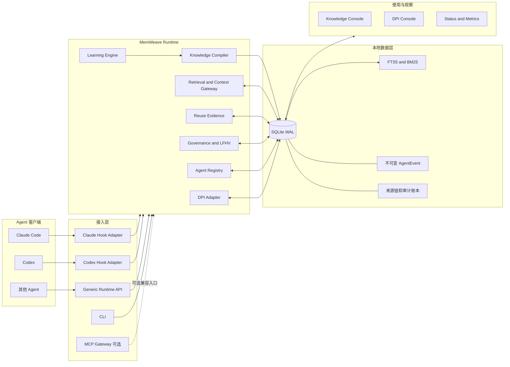
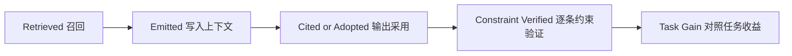
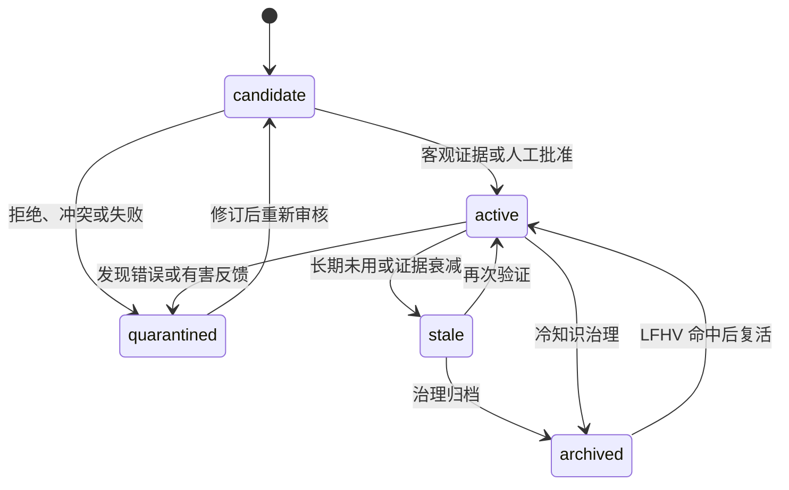
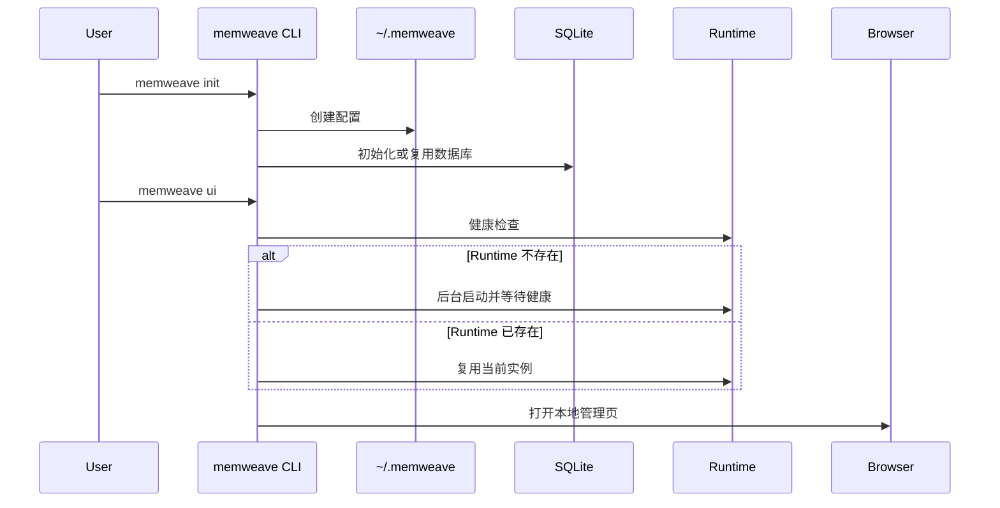
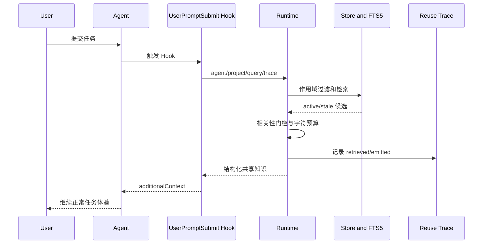
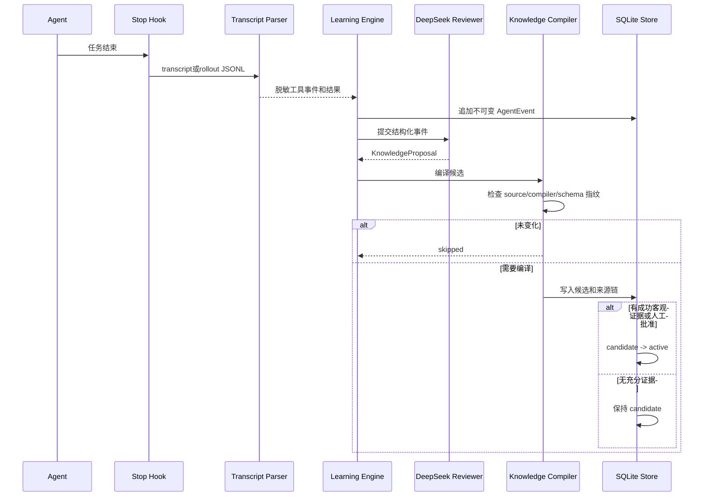
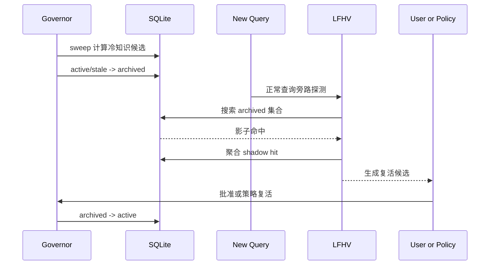
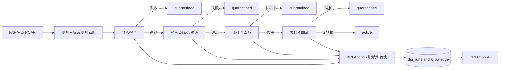

# MemWeave 全流程架构与测试记录

> **历史快照提示（2026-09-24 补注）**：本文保留 2026-09-22 的实现及实验口径，不再作为当前部署指南。现行安装、后台队列、四层召回、证据准入与产品边界请看 [MemWeave 系统框架与全流程说明](MemWeave框架架构.md)；最新验收见 [安装产品化与验收](安装产品化与验收_20260924.md)。旧图中的 DPI 内置链路、同步学习和可选 Runtime 安装方式已变更。历史 91 passed 不是当前测试基线。

> 文档日期：2026-09-22  
> 对应版本：`memweave-runtime 0.4.0`  
> 代码目录：MemWeave 仓库根目录  
> 当时自动化测试基线：`91 passed`  
> 文档用途：记录当前已经实现的组件、端到端工作流、验证证据和能力边界，作为后续开发、复盘、演示和面试准备的统一依据。

## 1. 项目定位

MemWeave 是一个运行在本地的 Agent 持续学习与知识治理框架。它将 Claude Code、Codex 等 Agent 在任务中产生的可复用经验，经过脱敏、结构化、证据校验和生命周期治理后，保存到共享知识库，并在后续相关任务中自动召回。

框架当前主要解决三个问题：

1. **跨会话自学习**：任务结束后从真实执行过程提炼候选知识，后续相关任务自动召回。
2. **多 Agent 知识复用**：不同 Agent 共享经过治理的结构化知识，而不是互相读取完整私人会话。
3. **知识库治理**：知识不是只增不减；框架提供候选、激活、过期、归档、隔离、影子召回和复活机制。

当前已经完成两个可运行实例：

- Claude Code 与 Codex 的双向知识共享和自动学习实例；
- DPI 规则生成、检查、回放结果治理和可视化实例。

MCP 是一个可选兼容入口。MemWeave 的学习、召回、存储和治理主链路不依赖 MCP，也不要求模型主动决定是否调用工具。

## 2. 当前实现范围与边界

| 能力 | 当前状态 | 准确说明 |
|---|---|---|
| Claude Code 自动接入 | 已实现 | 使用原生 Hook，在提交请求时召回，在任务结束时学习 |
| Codex 自动接入 | 已实现（需重启客户端加载最新配置） | 使用全局 `~/.codex/hooks.json`，解析 rollout JSONL；信任状态记录在 `~/.codex/config.toml` |
| Claude 与 Codex 双向共享 | 已验收 | 共用数据库和项目键，保留独立来源 Agent |
| 其他 Agent 探测与登记 | 已实现 | 可以检测、登记、停用，并通过 Runtime API 接入 |
| 其他 Agent 原生双向 Hook | 未全部实现 | 检测到 Agent 不等于已经具备自动学习 Adapter |
| 自动知识提炼 | 已实现 | DeepSeek Reviewer 从脱敏事件中提出候选知识 |
| 客观证据门禁 | 已实现 | 没有成功测试、命令或人工批准的候选不能自动进入正常召回 |
| 增量知识编译 | 已实现 | 基于来源、编译器版本和 Schema 版本决定跳过或重编译 |
| 轻量检索 | 已实现 | SQLite FTS5/BM25、别名、中文 n-gram、低信息词过滤和冲突仲裁 |
| 向量检索 | 当前默认未使用 | 历史 Hybrid 实验保留为对照，不属于当前生产路径 |
| 生命周期治理 | 已实现 | 支持 candidate、active、stale、archived、quarantined |
| LFHV 影子召回 | 已实现并完成受控实验 | 可发现仍有价值的归档知识并生成复活候选 |
| 知识版本替代图 | 未实现 | 当前没有显式 `supersedes` / `conflicts_with` 关系图 |
| Hot Set | 未实现 | 当前没有独立的热知识分层存储 |
| DPI 垂直实例 | 已实现 | 已接通 DPI SDK 结果、治理门禁、SQLite 和 Dashboard |
| 本地管理页面 | 已实现 | 查看知识、来源、复用证据、Agent、生命周期和 DPI 运行 |

## 3. 总体架构



架构上的关键划分：

- **Adapter 只处理客户端差异**：解析不同会话格式，发送统一事件，接收统一上下文。
- **Core 处理统一业务语义**：知识提炼、证据门禁、检索、复用和治理都与具体 Agent 解耦。
- **SQLite 是事实来源**：管理页、CLI、Runtime API 和 MCP 都读取同一套本地状态。
- **MCP 只是一种入口**：删除或关闭 MCP 不会破坏 Hook 主链路。

## 4. 组件清单

| 组件 | 主要文件 | 职责 | 是否位于请求热路径 |
|---|---|---|---|
| CLI | `cli.py` | 初始化、状态查看、启动或复用 Runtime 和管理页 | 否 |
| Agent Registry | `agent_registry.py`、`store.py` | 探测本机 Agent，登记和停用接入项 | 否 |
| Claude Adapter | `claude_learning_adapter.py`、`claude_transcript.py` | Claude Hook 输入输出和 transcript 解析 | 是 |
| Codex Adapter | `codex_learning_adapter.py`、`codex_transcript.py` | Codex Hook 输入输出和 rollout 解析 | 是 |
| Runtime Client | `runtime_client.py` | Adapter 与本地 Runtime 的统一 HTTP 客户端 | 是 |
| Local Runtime | `daemon.py`、`contracts.py` | 本地鉴权 API、页面和各组件编排 | 是 |
| Core Service | `service.py` | 统一知识、Agent、反馈和指标服务门面 | 是 |
| Learning Engine | `learning.py` | 事件、学习运行、召回事件和来源关联 | Stop 阶段 |
| Knowledge Compiler | `compiler.py` | 增量编译、编译指纹和来源链 | Stop 阶段 |
| Knowledge Store | `store.py` | SQLite Schema、知识 CRUD、搜索和审计 | 是 |
| Retrieval | `store.py` | FTS5/BM25、n-gram、过滤和冲突仲裁 | 是 |
| Reuse Evidence | `reuse.py` | 记录从召回到实际采用和验证的证据 | 是 |
| Governance | `governance.py` | 生命周期扫描、归档、LFHV 和复活 | 后台或手动 |
| DPI Adapter | `dpi.py`、`dpi_sdk_bridge.py` | 导入 DPI SDK 结果、脱敏、状态门禁和去重 | DPI 流程 |
| MCP Gateway | `server.py` | 向 MCP 客户端暴露兼容工具 | 可选 |
| Knowledge Console | `knowledge_dashboard.html` | 知识、Agent、来源、复用和治理管理 | 否 |
| DPI Console | `dashboard.html` | DPI 流水线和规则验证结果展示 | 否 |
| Evaluation | `evaluation.py`、`live_benchmark.py`、`scripts/` | 构造数据集、执行对照实验和生成报告 | 否 |

## 5. 组件详细说明

### 5.1 CLI

安装后提供统一命令：

```powershell
memweave init
memweave status
memweave ui
```

- `memweave init`：在 `~/.memweave` 创建本地配置，初始化或复用 SQLite 数据库；不会自动授权所有检测到的 Agent。
- `memweave status`：直接读取 SQLite，显示 Agent、知识状态、共享、学习和召回统计，不要求 Runtime 已启动。
- `memweave ui`：检测已有 Runtime；没有可用实例时在后台启动一个，再打开带本地鉴权信息的管理页面。

当前本机配置复用 `data/knowledge.db`，默认项目键为 `claude-codex-mvp`。桌面快捷方式已经统一调用 CLI 启动管理页。

### 5.2 Agent Registry

Registry 把“检测到软件”和“允许加入 MemWeave”分成两个动作：

1. 扫描可执行文件和常见配置目录；
2. 只显示真实检测到的 Agent；
3. 用户选择加入后写入 `agent_registry`；
4. 停用采用软停用，保留历史知识和来源记录。

内置检测候选包括 Claude Code、Codex、Cursor、Windsurf、Gemini CLI、Aider、Goose、OpenHands、OpenCode、Continue、Cline、Roo Code、Qoder 和 WorkBuddy。

当前本机实际检测到 Claude Code、Codex、Cursor、Gemini CLI、Qoder 和 WorkBuddy。Claude Code 与 Codex 的适配器已经实现，但只有在对应客户端配置中实际安装 MemWeave Hook 后才会触发 recall / learn；Agent Registry 的“已加入”只表示登记授权，不等于 Hook 已配置。其他 Agent 当前可登记并通过 Runtime API 使用共享知识，不应描述成全部完成了原生双向自学习。

### 5.3 Agent Adapter

Adapter 负责把不同 Agent 的输入输出转换成统一结构：

- Claude Adapter 解析 Claude Code transcript JSONL；
- Codex Adapter 解析 Codex rollout JSONL；
- Generic API 允许其他 Agent 按统一协议调用召回和学习接口。

Adapter 不负责决定知识是否正确，也不直接修改生命周期。它只提供以下信息：

- 当前 Agent、项目键、会话和 trace 标识；
- 用户请求；
- 脱敏后的工具调用、工具结果和任务完成事件；
- 本轮召回知识和后续采用反馈。

### 5.4 Local Runtime

Runtime 使用 FastAPI、Pydantic 和 Uvicorn，只监听 loopback，并通过 Bearer Token 鉴权。主要接口如下：

| API 分组 | 代表接口 | 用途 |
|---|---|---|
| 健康检查 | `GET /v1/health` | 判断 Runtime 是否可复用 |
| Agent | `/v1/agents/discover`、`/register`、`/disable` | 探测和维护 Agent |
| 知识 | `/v1/knowledge/search`、`/publish`、`/feedback` | 检索、发布和反馈 |
| 学习 | `/v1/learning/recall`、`/turn` | 请求前召回和任务后学习 |
| 复用 | `/v1/reuse/traces` | 查看知识是否真正进入使用过程 |
| 指标 | `/v1/metrics` | 查询学习、召回和复用统计 |
| 治理 | `/v1/governance/report`、`/sweep`、`/lfhv`、`/resurrect` | 生命周期管理 |
| DPI | `/v1/dpi/ingest`、`/import-sdk`、`/runs`、`/summary` | DPI 结果导入和展示 |

Runtime 是多 Agent 共用和 Web 管理需要的常驻层。只使用进程内 Hook Core 时可以不启动 HTTP daemon。

### 5.5 Core Service

`KnowledgeBridgeService` 是统一服务门面，隔离上层协议和下层存储。它负责：

- 发布、检索和审核知识；
- 处理反馈和指标；
- 调用 Agent Registry；
- 为 Runtime、CLI 和 MCP 提供同一套业务能力。

核心模块仅依赖 Python 标准库。FastAPI、Pydantic、Uvicorn 和 MCP SDK 都是可选安装项。

### 5.6 Learning Engine

Learning Engine 将一次 Agent 工作过程拆为不可变事件和一次学习运行：

1. 接收经过脱敏的工具和结果事件；
2. 保存 `AgentEvent`；
3. 调用 Reviewer 生成结构化 `KnowledgeProposal`；
4. 交给 Knowledge Compiler；
5. 建立知识、编译运行和来源事件之间的关联；
6. 根据客观证据或人工审核决定是否晋升。

`agent_events` 通过 SQLite Trigger 禁止 UPDATE 和 DELETE。这样可以重新编译知识，但不能改写它声称来自的历史事实。

### 5.7 Knowledge Compiler

编译器使用以下指纹确定一次来源是否需要再次处理：

```text
source_hash + compiler_version + schema_version -> manifest_hash
```

- 三者未变化：跳过重复编译；
- 编译器升级：允许用同一来源重新生成；
- Schema 升级：允许迁移到新的知识结构；
- 每个知识条目通过 `knowledge_compilation_links` 和 `knowledge_event_links` 追溯到编译运行和支撑事件。

当前已经实现来源链和增量编译，但尚未实现知识条目之间显式的替代、继承和冲突关系图。

### 5.8 Knowledge Store

数据层使用 SQLite WAL 和 FTS5。当前主要数据表如下：

| 表 | 保存内容 |
|---|---|
| `knowledge_records` | 知识正文、类型、作用域、状态、置信和统计信息 |
| `knowledge_evidence` | 每条知识的客观证据和审核信息 |
| `agent_registry` | 已登记 Agent、接入方式和启停状态 |
| `agent_events` | 不可变的脱敏任务事件 |
| `learning_runs` | 每次学习或编译运行 |
| `knowledge_event_links` | 知识与原始事件的关联 |
| `knowledge_compilation_links` | 知识与编译指纹、编译运行的关联 |
| `recall_events` | 查询、召回和注入记录 |
| `reuse_traces` 相关表 | 实际输出、引用、约束验证和收益证据 |
| `lifecycle_audit` | 生命周期状态变化审计 |
| `shadow_hits` | 按归档记录聚合的影子命中 |
| `shadow_probe_stats` | LFHV 探针统计 |
| `dpi_runs` | DPI 静态检查、编译、正负回放和最终状态 |

知识类型包括 `fact`、`preference`、`procedure` 和 `decision`。作用域包括：

- `project`：只对当前项目有效；
- `user`：允许在同一用户的不同项目或 Agent 间共享。

### 5.9 Retrieval and Context Gateway

当前默认检索模式为 `fts5-enriched`，执行顺序为：

1. 读取用户请求；
2. 提取普通词、别名和稀有标识符；
3. 对中文生成二元和三元 n-gram；
4. 过滤纯数字等低信息 token；
5. 使用 FTS5/BM25 召回候选；
6. 对稀有标识符进行 pin；
7. 使用 `verified_count` 等证据处理冲突候选；
8. 过滤作用域和生命周期状态；
9. 在 4000 字符预算内输出完整知识条目。

上下文网关不会把整个知识库塞入上下文，也不会截断一条知识后把残片伪装成完整知识。召回结果为空时，不注入额外记忆。

历史上曾试验本地语义模型的 Hybrid 检索。该路线效果较好，但热路径约 180 ms，冷启动约 26 秒，最终被轻量 FTS5 增强路线替代。当前源码中不存在作为默认路径的 `semantic.py`。

### 5.10 Reuse Evidence

框架把“查到了知识”和“知识真的产生作用”分开记录：



普通的历史 `used` 或 `verified` 标记不能冒充当前任务中的实际复用。复用 trace 可以记录：

- 哪条知识被检索；
- 是否真正写入上下文；
- Agent 输出是否引用或采用；
- 具体约束是否通过验证；
- 相比无记忆对照是否带来任务收益。

当前包含 `json_equals` 等独立验证器，用于避免仅凭模型自述判断正确性。

### 5.11 Governance and LFHV

知识生命周期为：



- `archived` 是可逆归档，不是删除；
- `quarantined` 停止正常召回，适合错误、冲突或危险知识；
- LFHV 在不污染正常上下文的情况下探测归档知识是否仍与新请求相关；
- `shadow_hits` 按知识记录聚合，空间复杂度与当前归档记录数量相关，而不是随查询次数无限增长；
- `lifecycle_audit` 每条知识最多保留 50 行，限制状态震荡导致的审计膨胀。

### 5.12 Web Console

管理页面包含两部分：

- `/knowledge`：知识列表、状态、作用域、共享、复用 trace、编译来源和 Agent 维护；
- `/`：DPI 流水线、规则运行、验证状态和证据摘要。

页面读取 Runtime API，不单独维护另一份状态。桌面入口使用用户设计的 MemWeave 图标，并通过 `memweave ui` 自动确保 Runtime 可用。

### 5.13 DPI 垂直实例

DPI 接入明确分工：

- DPI SDK：规则生成、静态检查、隔离编译、Zealot 正样本和负样本回放；
- MemWeave：结果转换、脱敏、状态门禁、证据存储、去重、历史追踪和 Dashboard。

DPI 状态门禁如下：

| 验证结果 | 知识状态 |
|---|---|
| 仅静态检查通过 | `candidate` |
| 静态检查失败或未生成 | `quarantined` |
| 编译失败 | `quarantined` |
| 正样本未命中 | `quarantined` |
| 负样本误报 | `quarantined` |
| 编译通过、正样本全命中、至少一个负样本且无误报 | `active` |

这里的 `active` 只表示通过当前保存的证据集，不代表规则已经提交、合并或部署到生产。

### 5.14 MCP Gateway

MCP Gateway 用于让支持 MCP 的客户端显式查询或触发 MemWeave 能力，适合：

- 从 Codex 发起 DPI 每日流水线；
- 手动检索、审核或查看知识；
- 兼容只支持 MCP 的客户端。

MCP 不负责框架内部存储、知识编译或生命周期逻辑。主链路仍为 Agent Hook / Runtime API / Core / SQLite。

## 6. 端到端全流程

### 6.1 初始化与启动



### 6.2 请求前自动召回



### 6.3 任务后自动学习



### 6.4 反馈、冲突与隔离

1. 后续任务记录每条知识的实际采用和独立约束验证；
2. 正向验证增加可信证据，供冲突仲裁和治理使用；
3. 拒绝、错误结果或有害反馈将知识移入 `quarantined`；
4. 修订后的知识重新作为 `candidate` 进入证据门；
5. `active` 从来不表示绝对正确，只表示通过了当前证据门。

### 6.5 生命周期治理与恢复



### 6.6 多 Agent 共享

多 Agent 共享的是结构化知识，不是原始会话全文：

```text
Claude 会话 -> 脱敏事件 -> 证据化知识 -> user/project scope -> Codex 召回
Codex 会话  -> 脱敏事件 -> 证据化知识 -> user/project scope -> Claude 召回
```

每条知识保留来源 Agent、项目、事件和编译链。`project` 作用域防止跨项目泄漏；只有 `user` 作用域知识才允许跨项目共享。

### 6.7 DPI 全流程



每日规则流水线可以通过 MCP 触发，但实际状态计算、证据存储和治理由 DPI SDK、Adapter 和 MemWeave Core 完成。

## 7. 安全、隐私与数据边界

- Runtime 只监听本地回环地址；
- HTTP API 使用 Bearer Token；
- Token 和模型 Key 不写入代码仓库或本文档；
- 原始私人会话全文不进入共享知识库；
- 保存的是脱敏工具事件、来源 hash、结构化知识和验证证据；
- DPI 数据库不保存客户 PCAP、内网地址、凭据、公司完整规则正文或敏感文件路径；
- `project` 作用域知识不得跨项目召回；
- 归档是逻辑状态变化，保留可审计和可恢复性。

## 8. 测试体系

当前测试分为四层：

| 层级 | 目的 | 代表证据 |
|---|---|---|
| 自动化测试 | 防止代码行为回归 | 当前 `91 passed` |
| 确定性端到端验收 | 验证 Adapter、API、证据和状态流 | 双向 Adapter、DPI 验收 |
| 真实模型受控实验 | 测量有无记忆的任务差异 | 100 用例 DeepSeek、学习曲线、坏记忆 |
| 资源和长期治理实验 | 测量时延、内存、存储和知识收缩 | 轻量化、生命周期和 LFHV |

## 9. 自动化测试记录

2026-09-22 在当前工作区执行：

```powershell
$env:PYTHONPATH = "$PWD\src"
python -m pytest -q
```

结果：

```text
91 passed in 8.08s
```

覆盖范围包括：

- Knowledge Store、生命周期和旧库迁移；
- Claude/Codex transcript 与 Hook Adapter；
- Runtime API、鉴权和 Runtime Client；
- Agent 检测、登记、停用和 CLI；
- 编译指纹、增量编译、来源链和不可变事件；
- FTS5 增强检索、作用域隔离和冲突仲裁；
- 复用 trace 与逐条验证；
- Governance、影子账本、LFHV 和审计上限；
- DPI Adapter 和状态门禁；
- 核心依赖、内存、存储和账本增长预算。

## 10. 双向 Adapter 验收记录

证据文件：`docs/双向Adapter实例验收_20260920.md`

| 检查 | 结果 |
|---|---|
| Claude 来源知识被 Codex Hook 召回 | PASS |
| Codex 来源知识被 Claude Hook 召回 | PASS |
| 无关请求不注入 | PASS |
| 主链路不使用 MCP | PASS |
| 真实 Codex CLI 收到 Hook 上下文 | PASS，返回 `LIVE_HOOK_OK` |

这组验收证明本地 Claude/Codex 双向通道已经打通。它不证明所有 Agent 都具备相同的原生 Hook 支持。

## 11. 100 用例真实 DeepSeek 检索实验

### 11.1 首轮 FTS5 基线

证据目录：`outputs/live_100_20260921_171225/`

| 指标 | 结果 |
|---|---:|
| 任务 / 真实模型调用 | 100 / 300 |
| Baseline / Auto / Oracle | 10% / 80% / 100% |
| Auto 相对 Baseline | +70 个百分点 |
| Recall@3 | 77.8% |
| MRR@3 | 0.778 |
| 无关注入率 | 10% |
| 跨语言改写 | 0/20 成功 |
| 检索 P50/P95 | 2.101/2.813 ms |

发现的问题：关键词检索无法处理跨语言改写；纯数字等低信息 token 会导致无关知识注入。

### 11.2 Hybrid 改进实验

证据目录：`outputs/live_100_20260921_172946/`

| 指标 | 结果 |
|---|---:|
| Baseline / Auto / Oracle | 10% / 98% / 100% |
| Recall@3 | 97.8% |
| MRR@3 | 0.978 |
| 跨语言改写 | 18/20 成功 |
| 无关注入率 | 0% |
| 检索 P50/P95 | 3.08/179.346 ms |
| 本地模型冷启动 | 约 26 秒 |

Hybrid 验证了语义召回能补足跨语言问题，但热路径和冷启动过重，因此没有成为当前默认架构。

### 11.3 最终轻量 FTS5 增强实验

证据目录：`outputs/live_100_20260921_174535/`

| 指标 | 结果 |
|---|---:|
| 任务 / 真实模型调用 | 100 / 300 |
| API 失败 | 0 |
| Baseline / Auto / Oracle | 10% / 100% / 100% |
| Auto 相对 Baseline | +90 个百分点 |
| Recall@3 | 100% |
| MRR@3 | 1.0 |
| 无关注入率 | 0% |
| 项目隔离越界 | 0/15 |
| 检索 P50/P95 | 3.027/4.479 ms |
| Adapter P50/P95 | 10.726/13.337 ms |
| 检索模式 | `fts5-enriched` |

可得结论：在这一固定受控数据集上，别名、中文 n-gram、低信息词过滤和标识符处理补齐了首轮检索缺陷，同时保留毫秒级检索。

不能外推的结论：该实验是受控合成数据、单模型、每用例单次运行，没有置信区间，不能直接代表长期真实生产质量。

## 12. 记忆增量价值实验

证据目录：`outputs/value_20260922_1000/`

目录名包含 `1000`，但报告中的实际实验规模是 30 个任务，每个任务运行 baseline、auto、oracle 三组，共 90 次真实模型调用。

| 指标 | 结果 |
|---|---:|
| 通用字段合规 | 三组均 100% |
| 约定字段合规 | Baseline 0%，Auto 100%，Oracle 100% |
| 字段整体合规 | 50% -> 100% |
| 任务全对率 | 0% -> 100% |

这组实验说明 MemWeave 能把模型原本不知道的项目约定提供给任务，从而提高约定字段合规性。它证明的是**信息供给价值**，不能表述为模型本身推理能力被训练提升。

## 13. 学习曲线实验

证据目录：`outputs/curve_fixed_20260922/`

| 设置或指标 | 结果 |
|---|---:|
| 任务族 | 20 |
| 每族重复次数 | 3 |
| 第一次 baseline / memory | 0% / 0% |
| 第二次、第三次 memory | 100% |
| 第二次、第三次 baseline | 0% |
| 每族累计失败 | 3 次降至 1 次 |
| 重复失败下降 | 66.7% |

20 条知识经过真实 Reviewer、事件关联和自动晋升链路。结果表明，在受控重复任务中，第一次失败产生的可验证经验可以被后续会话复用。当前仍属于合成任务族实验。

## 14. 坏记忆与隔离实验

证据目录：`outputs/badmem_fixed_20260922/`

| 场景 | 暴露或结果 |
|---|---|
| 错误知识保持 `candidate` | 暴露 0，伤害 0 |
| 错误知识为 `active`，正确/错误证据 1:1 | 成功率 90%，净伤害 10% |
| 正确/错误证据 3:1 | 成功率 100%，净伤害 0 |
| 对错误知识 reject 并转 `quarantined` | 暴露 0，恢复 100% |

可得结论：候选门和隔离态能阻止未经验证或已拒绝的坏知识进入正常召回；证据优势可帮助冲突仲裁。

明确局限：正确和错误知识证据完全相同时仍存在不可区分风险。该实验不能支持“MemWeave 能抵御知识投毒”的说法。

## 15. 生命周期与 LFHV 实验

### 15.1 有效的 100 条受控实验

证据目录：`outputs/lifecycle_100_20260922_135306/`

| 阶段 | active | archived | 任务成功率 | Recall@3 | 无关注入率 | 检索 P50/P95 |
|---|---:|---:|---:|---:|---:|---:|
| 无治理对照 | 100 | 0 | 100% | 100% | 0% | 1.75/2.14 ms |
| 治理后、LFHV 前 | 80 | 20 | 100% | 100% | 0% | 1.59/1.93 ms |
| LFHV 复活后 | 100 | 0 | 100% | 100% | 不适用 | 1.66/1.92 ms |

LFHV 共运行 20 次探针，识别 20 条归档知识并复活 20 条。

可得结论：在这 100 条受控知识上，活跃召回集合从 100 缩减到 80 后，热任务成功率和 Recall@3 没有下降；归档知识再次被请求时可被影子探针发现和恢复。

不能得出的结论：这不证明物理数据库体积长期有界，也不证明任意规模和真实业务分布下任务质量都不下降。

### 15.2 无效的真实模型生命周期轮次

证据目录：`outputs/live_lifecycle_100_20260922_140941/`

该轮任务成功率未下降，但报告同时显示：

- all-active 状态总数为 0；
- 归档后状态总数仍为 0；
- LFHV 复活为 0。

这些数据相互矛盾，说明该轮生命周期状态装置或数据库连接存在问题。因此该轮只能保留为故障记录，不能用来证明归档和 LFHV 有效。生命周期主证据应使用上一节的确定性受控实验。

## 16. 轻量化实测

证据文件：`docs/MemWeave轻量化报告_20260922.md`

### 16.1 运行时足迹

| 层 | 额外内存 | 第三方依赖 | 启动时间 |
|---|---:|---:|---:|
| Core：Store + Governance | 约 5.0 MB | 0 | 39.2 ms |
| Service Facade | 约 4.9 MB | 0 | 36.8 ms |
| Learning Hook | 约 9.4 MB | 0 | 95.5 ms |
| HTTP daemon | 约 33.3 MB | 15 | 483.6 ms |

框架不加载 `torch`、`transformers`、`sentence-transformers`、FAISS 或 ONNX，不运行本地模型，因此显存占用为 0。模型推理使用外部 API。

### 16.2 存储增长

| 记录数 | 数据库大小 | 平均字节/记录 |
|---:|---:|---:|
| 200 | 372 KB | 1905 B |
| 1000 | 1408 KB | 1442 B |
| 5000 | 6608 KB | 1353 B |

按当前测量约为 1.35 KB/记录：1 万条约 13 MB，10 万条约 135 MB。该值是当前 Schema 和测试数据下的估算，正文长度或索引变化会改变结果。

### 16.3 已落实的增长约束

- 核心依赖固定为 0，Web 与 MCP 使用 optional extras；
- `shadow_hits` 从按查询追加改为按归档记录聚合；
- `resurrect` 后删除对应影子账本；
- `lifecycle_audit` 每条知识最多保留 50 行；
- 自动化测试约束核心依赖、每条记录字节数、影子账本行数和审计上限。

注意：SQLite 位于桌面同步或杀软重点扫描目录时，close 延迟曾从约 2 ms 放大到约 77 ms。性能对比必须在同一存储环境和同一测点下进行。

## 17. DPI 实例验收记录

证据文件：`docs/DPI垂直实例接入设计与验收_20260920.md`

首次导入记录：

- 每日批次 30 条，其中 25 条静态通过等待回放，5 条未生成或需要复核；
- Soulseek：保存证据中 3 个正样本命中、2 个负样本无误报，标记为 `historical-evidence`；
- 蚂蚁 CodeFuse：隔离编译通过，正样本命中，独立负样本无误报。

Soulseek 记录证明历史保存证据上的规则回归通过，不应描述成在 2026-09-20 重新执行了实时 Zealot 回放。

## 18. 当前能够证明的结论

1. Claude Code 与 Codex 可以通过原生 Hook 使用同一个 MemWeave 知识库，不依赖 MCP。
2. 知识可以从真实事件经过 Reviewer、增量编译、来源关联和证据门进入召回集合。
3. 用户请求不会加载全部知识；当前轻量检索在固定 100 用例中达到 Recall@3 100%、无关注入 0%、P95 4.479 ms。
4. 复用证据能够区分召回、注入、采用、验证和对照收益，不再用普通反馈冒充实际使用。
5. 错误候选和已拒绝知识可以被门禁或隔离，但同证据冲突仍存在风险。
6. 在 100 条受控知识实验中，活跃集合缩减 20% 后热任务质量未下降，LFHV 能找回被重新需要的归档知识。
7. 核心层不依赖第三方包，不使用本地模型，进程内 Hook 额外内存约 9.4 MB。
8. DPI 已作为一个真实垂直场景接入统一证据和治理模型。

## 19. 当前不能证明或尚未实现的内容

1. 不能证明框架在长期生产使用中一定越用越聪明；当前证据来自受控实验和本地实例。
2. 不能证明所有 Agent 已自动接入；目前只有 Claude Code 和 Codex 有完整原生 Hook 实例。
3. 不能声称抵御知识投毒；当前仅验证了候选门、证据冲突和隔离的一组有限场景。
4. 不能证明数据库文件长期有界；当前治理收缩的是正常召回集合，并限制了部分账本增长。
5. 没有完成显式知识版本图、语义冲突关系和 Hot Set。
6. 最终 100 用例实验没有多模型、多轮重复和统计置信区间。
7. DPI `active` 不代表规则已经进入正式规则库或生产设备。
8. 其他 Agent 的 Runtime API 可接入能力，不等于已经拥有与 Claude/Codex 一样的无感 Hook 体验。

## 20. 后续优先级

### P0：真实使用闭环

- 用日常 Claude/Codex 真实任务持续记录学习、召回、采用和失败案例；
- 给复用 trace 增加更稳定的任务级独立验证；
- 定期抽样人工审核 candidate、active 和 quarantined；
- 在 DPI 日常规则任务上建立有无 MemWeave 的长期对照。

### P1：知识治理能力

- 增加 `supersedes`、`conflicts_with` 等显式知识关系；
- 建立知识版本、替代和合并流程；
- 设计 Hot Set 与冷知识层，但保持当前轻量约束；
- 修复并重跑真实模型生命周期实验的状态统计装置。

### P2：框架泛化

- 为 Qoder、WorkBuddy 等已检测 Agent 逐个实现真实 Adapter，而不是只登记名称；
- 稳定 Generic Adapter SDK 和事件 Schema；
- 发布前剥离内部 DPI 资产，只保留通用接口和可公开 Demo；
- 增加多模型、多轮重复、置信区间和真实开发任务集。

## 21. 常用运行与复现命令

```powershell
# 进入项目
cd C:\path\to\MemWeave

# 开发安装
python -m pip install -e ".[runtime,test]"

# 初始化、状态和管理页
memweave init
memweave status
memweave ui

# 全量测试
$env:PYTHONPATH = "$PWD\src"
python -m pytest -q

# 轻量化实测
python .\scripts\report_footprint.py

# 双向 Adapter 确定性验收
.\demo\run-bidirectional-adapter-smoke.ps1

# DPI 管理页
.\demo\start-dpi-dashboard.ps1
```

## 22. 证据索引

| 内容 | 文件或目录 |
|---|---|
| 框架总览 | `README.md`、`docs/MemWeave框架架构.md` |
| 双向 Adapter | `docs/双向Adapter实例验收_20260920.md` |
| 复用证据 | `docs/MemWeave复用证据与评测_20260921.md` |
| 轻量化 | `docs/MemWeave轻量化报告_20260922.md` |
| 生命周期治理 | `docs/MemWeave生命周期治理落地_P1P2_20260922.md` |
| DPI 实例 | `docs/DPI垂直实例接入设计与验收_20260920.md` |
| 初始 FTS5 实验 | `outputs/live_100_20260921_171225/` |
| Hybrid 实验 | `outputs/live_100_20260921_172946/` |
| 最终轻量检索实验 | `outputs/live_100_20260921_174535/` |
| 记忆增量价值 | `outputs/value_20260922_1000/` |
| 学习曲线 | `outputs/curve_fixed_20260922/` |
| 坏记忆 | `outputs/badmem_fixed_20260922/` |
| 有效生命周期实验 | `outputs/lifecycle_100_20260922_135306/` |
| 有缺陷生命周期实验 | `outputs/live_lifecycle_100_20260922_140941/` |

## 23. 文档维护规则

后续更新本文件时，遵循以下规则：

1. 新能力只有在代码、测试和可复查证据同时存在时，才从“设计中”改为“已实现”；
2. 实验记录必须保留任务规模、模型、调用次数、失败数、数据目录和结论边界；
3. 失败实验不删除，标明失败原因和为何不能作为证据；
4. 历史方案与当前默认路径分开记录；
5. 不写入 API Key、Token、客户 PCAP、内部规则正文和其他敏感材料；
6. 每次架构变更后更新组件表、流程图、测试基线和“能证明/不能证明”两节。
