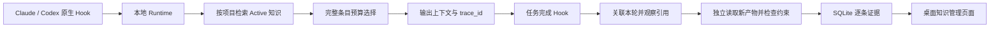

# MemWeave 复用证据与评测

本次实现日期：2026-09-21。目的是回答两个不同的问题：知识有没有进入后续任务，以及进入以后是否改善了任务结果。前者靠可追踪证据，后者需要受控对照实验。

## 已实现的链路



框架 Core 中新增 `reuse.py`，与 MCP 无关。Claude 和 Codex 共用相同的跟踪和验证逻辑；Runtime Client 与两侧 Hook 传递可选 `turn_id`、`cwd`。客户端照常启动，不要求模型主动调用 MCP。

### 证据分级

| 阶段 | 保存什么 | 能说明什么 | 不能说明什么 |
|---|---|---|---|
| 检索 | 排名、FTS score、知识 ID、来源、版本内容哈希 | 检索器选中了它 | 它与任务必然相关 |
| 上下文输出 | 实际输出条目、字符数、上下文哈希 | Adapter 将完整条目放入返回上下文 | 客户端一定接收、模型一定使用 |
| 观察到引用 | 本轮助手文本或工具输入出现知识 ID | 知识 ID 出现在后续行为中 | 引用内容正确、知识改善了结果 |
| 约束验证通过 | 独立检查结果、新产物 SHA256 | 本轮产物满足该条知识声明的约束 | 任务成功由记忆造成、全部经验已被正确采用 |
| 对照任务收益 | Baseline / Auto / Oracle 同题结果 | 在控制条件下观察到性能或成功率差异 | 小样本差异能推广到所有真实任务 |

工具输出中的回显不计为助手引用。普通自然语言知识没有专门验证器时，只展示引用或“采用未知”；不会凭模型一句“我用过了”升级为验证成功。

旧版会在整轮任意测试成功后给所有召回知识添加 verified；没有测试也会添加 used。这两种自动记功已移除。旧数据不删除，管理页改称“历史反馈”，新的复用计数只读取新表 `reuse_traces`。手工批准 Active 是准入审核，不计为跨 Agent 复用。

### 如何避免错配和重复

- 优先以 Agent + 项目 + session + turn_id 定位。缺少 turn_id 时，可通过输出中的 trace_id 定位。
- 再无法定位时，只有唯一 prompt 哈希相等才关联，并标注 `unique_prompt_hash`；此时不允许强验证记功。
- 同时匹配多轮时不归因，不把“最近的一轮”当成必然正确。
- 同一 turn_id 重试返回原上下文，不重复插入 trace；同 ID 换 prompt 拒绝。
- 只注入完整知识块，超过 4000 字符预算的条目记录为未输出，不再截断内容后把所有候选都算作已注入。
- 新 trace 不保存原始对话或产物全文；保存知识快照、哈希与结构化结果。上下文快照用于重试一致性，不等同于会话原文。

FTS score 是排序依据，不能解释成语义相关概率。当前长请求仅使用前 500 字符进行检索，这也是后续查询重写需要处理的边界。

## 当前支持的独立验证器

本版支持显式声明的 `json_equals` 验证器。可以将知识内容写成：

```json
{
  "instruction": "生成 widget-result.json 时使用本项目的 version=7。",
  "reuse_check": {
    "kind": "json_equals",
    "artifact": "widget-result.json",
    "equals": {"version": 7}
  }
}
```

该知识仍需正常经过准入审核成为 Active。召回时记录工作目录下目标产物的基线，任务结束后由 Core 自己读取并验证。

通过条件：明确关联本轮、该知识确实输出、观察到该知识 ID 引用、产物相较基线新增或内容变化、JSON 对应字段满足约束。原来的正确文件没有变化，不计作本轮验证。缺文件、不合法 JSON、无工作目录、越界路径、产物过大等都有独立状态，不会被算为成功。

只允许工作目录内的相对路径，拒绝 `..`、绝对路径和解析后越界的符号链接，文件最多读取 1 MiB。不执行知识内容里的脚本。当前不是通用自然语言验证器，也还没有把任意 DPI 回放输出自动关联成逐条知识的复用证明。

这套检查仍有边界：知识本身的约束可能不充分；进程外并发写入产物可能干扰归因；引用可被模型照抄；本地文件系统上的路径检查不能抵御有意的并发路径替换。后续高强度评测应使用独立任务工作目录、固定知识快照和任务专用验证器。

## 现在怎么查看

双击桌面“MemWeave知识管理”，原有入口不变。页面新增“实际复用证据”：

1. 概览显示输出、引用、已检查、约束通过和跨 Agent 约束通过的条次数，以及检索 P50/P95。
2. 展开最近 20 次记录，查看来源 → 消费 Agent、会话、trace_id、每条知识的进展。
3. 点开某条知识，可以单独看它最近 100 次复用记录和产物哈希。

没有新任务时计数为零是正常的。不会把历史共享标签折算为“实际复用”。本版升级 Runtime 到 0.4.0，知识管理和 Codex 快捷方式会检查服务版本，重新打开时替换旧版服务；已经开启的 Claude 会话需关闭后重新用原快捷方式打开才能加载新 Runtime。

### Active 与实际复用的区别

`Active` 只表示知识已经通过客观证据或人工审核，可以进入正常召回范围。详情里的“批准为 Active”是候选知识的状态变更操作，不能重复当作复用验收，也不能证明另一个 Agent 已经使用过它。已处于 `Active` 的知识不应继续显示这个批准按钮。

反向验收需要在另一个 Agent 发起一轮真实任务：请求前由对应 Hook 召回知识，Runtime 记录 `source_agent → consumer_agent`、会话、trace、是否输出到上下文、是否观察到引用，以及约束检查结果；任务结束后再查看该知识的逐轮复用记录。只有这条链路存在，才能说“被另一个 Agent 实际复用”。

接口：`POST /v1/reuse/traces`，请求为 `project_key`、可选 `knowledge_id` 与 `limit`，需要原有 Bearer token；`POST /v1/metrics` 新增 `reuse`。旧 `recall` 指标为兼容保留，并明确标成历史会话级命令关联，不能用作新证据。

## 已执行的离线诊断

输入：`evaluation/retrieval_cases.json`，10 条人工定义知识、20 条正查询、10 条无关查询。正查询包括 10 条英文关键词请求和 10 条中文改写；负查询包括完全无关和共享词但意图不同的请求。

执行：

```powershell
# 从 MemWeave 仓库根目录运行
python .\scripts\evaluate_memweave.py
```

脚本使用独立数据库，不连接日常 Runtime、不消耗模型 API。每次输出新目录，已存在目录不会被覆盖。每题保存标准答案 ID、实际召回及输出 ID、trace_id、耗时，便于复查错误。

本次结果位于 `outputs/evaluation_20260921_162814/`：

| 指标 | 本次结果 | 定义 |
|---|---:|---|
| Precision@3 | 16.7% | 正查询：前三条中正确条数 / 3，少于三条仍除以三 |
| Recall@3 | 50.0% | 正查询：找回的相关知识 / 标注相关知识 |
| MRR@3 | 0.500 | 正查询：首条正确知识排名的倒数，未找到为零 |
| 无关请求注入率 | 40.0% | 10 条负查询中错误注入的请求比例 |
| 检索 P50 / P95 | 2.254 / 2.605 ms | 搜索调用的进程内时间 |
| Adapter P50 / P95 | 9.144 / 10.395 ms | recall 调用含写库，不含进程启动与 HTTP |
| 真实首 token 时间 | 未测量 | 需在真实客户端请求到首个输出 token 之间测量 |
| 真实任务成功率增益 | 未测量 | 需真实模型三组实验 |

这些数字只描述本机这组小样本，不是整体产品效果。当前英文关键词能找回对应知识，但中文改写没有召回；无关请求中的 HTTP、Python、SSH、JSON 等词又造成错误注入。后续值得优化的是查询理解、相关性门控和语义召回，不能只追求召回数量。

报告还包含两个方向的确定性 Adapter 演示：Claude 来源 → Codex、Codex 来源 → Claude，分别验证一条结构化知识。产物和引用由测试脚本写入，用来验证证据链机制，不是实际 Claude/Codex 模型成功率。演示数据库与真实知识库分离。

## 真正证明“用了以后更好”的实验

每个任务使用相同模型版本、系统提示、工具权限、知识快照、任务输入和独立初始工作目录，随机化组别执行顺序并重复运行：

| 组别 | 可访问记忆 | 用途 |
|---|---|---|
| Baseline | 关闭记忆，不能看共享数据库或上一组产物 | 测模型原有能力 |
| Auto | 框架自动检索与预算选择 | 测实际产品效果 |
| Oracle | 人工标注的正确知识，同等格式与预算 | 区分检索失败与知识使用失败 |

任务提示不能包含隐藏目标答案，Oracle 不能额外得到验收答案；任务结束后运行统一独立验收器。验证器只读取该轮独立产物，不根据助手自评打分。应同时包含：需要跨 Agent 经验的任务、不需要记忆的普通任务、相似错误知识、知识过期和作用域隔离任务。

每次记录 JSONL：`task_id`、`repeat`、`mode`、`model`、`snapshot`、`dataset_version`、`success`、`evidence_ref`；可选 `ttft_ms`、`total_ms`、`input_tokens`、`output_tokens`。未测量写 null，不能写零或假结果。

```json
{"task_id":"task-001","repeat":1,"mode":"baseline","model":"deepseek-flash","snapshot":"snapshot-v1","dataset_version":"tasks-v1","success":null,"evidence_ref":null,"ttft_ms":null,"total_ms":null,"input_tokens":null,"output_tokens":null}
```

采集完后执行：

```powershell
python .\scripts\evaluate_memweave.py --paired-results .\evaluation\my-results.jsonl
```

评分器只将三组结果完整、模型和快照一致的任务纳入差值分母，报告 Auto−Baseline、帮到的任务数、反而损害的任务数，以及各组延迟和 token P50/P95。缺结果单独统计，不能把中途失败或没跑的组默认为成功。真实成功/失败必须提供证据引用，但评分器本身不审核引用文件内容；仍需对实验采集程序和验收器进行审计。

本版已实现评分器，没有自动驾驶三个真实模型组，也没有实际测得自学习收益。后续应扩大真实任务集、记录失败类别并计算置信区间，避免用几个演示案例下结论。

## 测试记录与后续边界

45 项单元/API 测试通过，覆盖错误归因、多条知识独立判定、作用域和轮次隔离、旧数据保留、完整上下文预算、重复事件、旧产物不记功、路径越界、API 鉴权及指标分母。

双向 Hook 隔离冒烟通过。修复测试脚本空 Runtime 地址仍回退到日常服务的问题，测试显式使用 `MW_RUNTIME_MODE=local`。

桌面 Chromium 检查通过：概览、逐条证据、产物 SHA256、弹窗均正常，无页面错误，无横向溢出。截图在本次评测输出目录。不增加移动端功能。

知识治理方面，当前已存在候选审核、去重和隔离，但此次未实现自动遗忘或压缩。后续还需评测增长速率、重复率、过期知识残留、错误淘汰率和被淘汰知识的恢复能力；这些不能用复用次数替代。


运行状态：代码和启动入口已更新，隔离 Runtime 的 API 与浏览器检查均通过。自动审批拦截了停止并重启日常 Runtime 的操作（仅返回 blocked by policy），因此不能声称现有进程已经升级。重新打开知识管理和 MemWeave-Codex 快捷方式会按版本检查加载新版；已开启的 Claude 会话需重新启动。原日常知识库已用 SQLite backup 保存副本。
