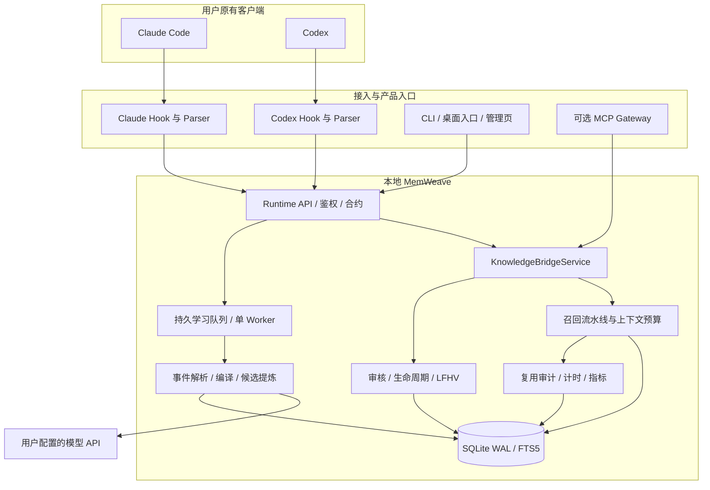
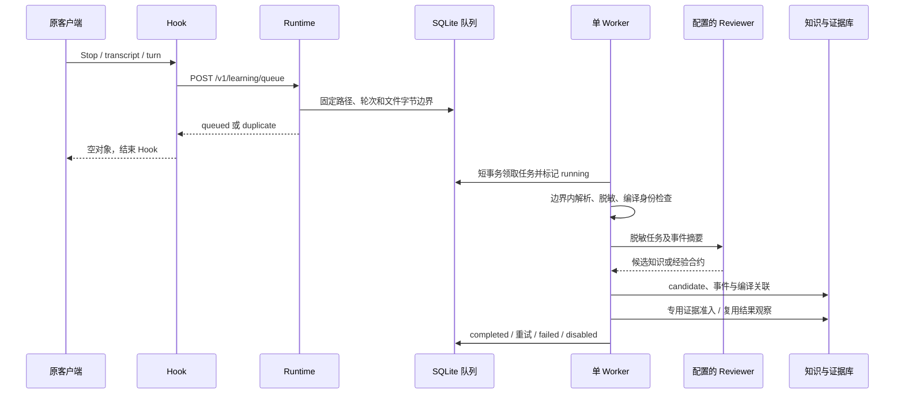
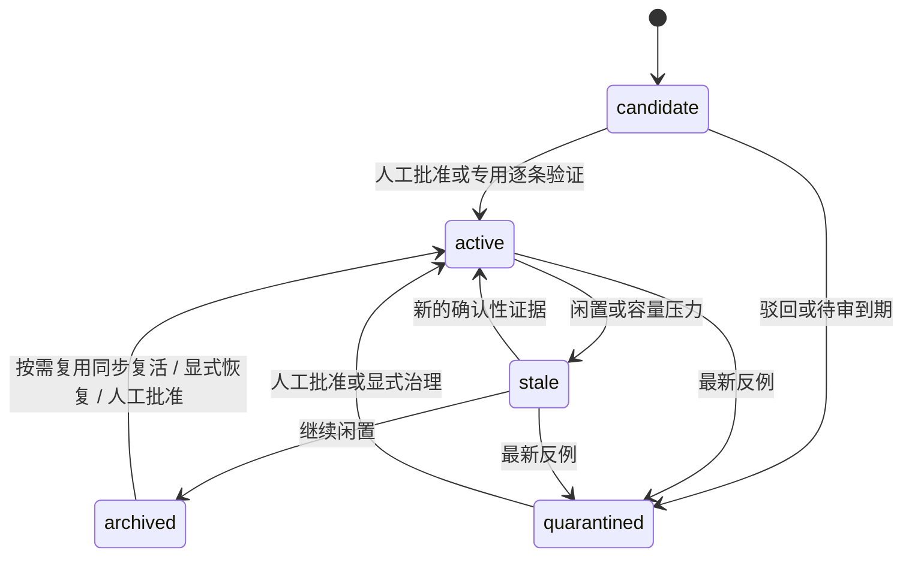

# MemWeave 系统框架与全流程说明

> 更新日期：2026-09-29；对应本地版本：`memweave-runtime 0.5.0a1`（本地知识决策修订；本轮变更未运行测试）。  
> 本文是现行架构入口，依据本地源码和已保存的验收记录更新。历史实验按原日期保留，不把历史结果当作当前版本的新测量。  
> 发布状态：本地可构建、安装及运行，尚未发布 PyPI / GitHub。实机产品验收范围为 Windows / Python 3.12。

## 阅读导航

2026-09-29 当前改动：LFHV 当轮复用与同步恢复、统一术语处理、正文索引升级和答案类型门禁。实现说明见 [本轮修改记录](LFHV按需复用与召回门禁修改_20260929.md)。本轮未执行测试；下列旧报告仅代表各自日期的版本。

本次修订增加原文约束准入、有限自动采纳、本轮使用判断、LFHV 恢复证据校验，以及明确赋值知识的版本替代。2026-09-27 又补充了轻量中英文术语桥、旧记录的最小证据门和外部解释问题的扩展抑制。实现与扩展测试见 [三层知识决策修复与扩展评测](三层知识决策修复与扩展评测_20260926.md)和[知识版本冲突治理与验收](知识版本冲突治理与验收_20260926.md)。历史测试结果仍按原日期保留。

- §1–3：定位、总图、组件职责。
- §4–5：安装配置、Agent 接入与项目隔离。
- §6–8：四层召回、后台学习、经验合约。
- §9–11：生命周期、数据库、管理页面与接口。
- §12–14：故障处理、性能口径、测试与证据。
- §15：发布前缺口和后续实验。

## 1. 定位与设计边界

MemWeave 是本地运行的跨 Agent 共享知识与治理框架。Claude Code 与 Codex 通过原生 Hook 接入，使用统一知识记录，在相关任务中按需获取上下文。对话结束后由后台提炼候选，按人工审核或受约束的验证规则决定是否参与正常召回。

项目重点是三个可检查的能力：

1. **跨 Agent 供给与复用证据**：统一不同客户端的事件格式，分别记录检索、上下文输出、来源引用和逐条验证。
2. **知识治理**：候选、激活、降级、归档、隔离及永久移除具有不同语义，不用“已经入库”代替“已经可信”。
3. **LFHV 按需复用、同步复活**：合格归档知识可在当前请求里补入上下文，同时恢复为 active；恢复与本轮输出使用同一事务，未输出就不自动恢复。

跨会话持久化是基础能力，不单独包装成创新。自学习指知识和经验影响后续上下文，不更新模型参数，不自动执行经验里的命令，不自动改写客户端的系统提示词。

边界如下：

- Core 的知识规则不依赖 Web 或 MCP；完整产品默认安装 Web Runtime 以便直接使用 UI。
- MCP 是可选网关。原生 Hook 自动触发主流程，不依赖模型主动选择工具。
- DPI Harness 是独立项目。领域路由、规则编译和 PCAP 回放留在 Harness；框架只提供通用服务。历史实例的 HTTP 外壳可以复用 Runtime 引擎，但领域逻辑不因此成为 Core 的一部分。
- 本机共享 token 是调用门槛，不是多租户身份认证；项目 scope 也不能等同于对恶意本地调用方的权限隔离。

## 2. 系统总图



图表示主要逻辑依赖，不表示每项能力都是独立进程。正常使用通常为一个本地 Runtime 进程、一个后台学习线程，以及客户端触发的短生命周期 Hook 进程。MCP 当前可直接调用同一 Service/Core，不应画成必经 Runtime HTTP。CLI 的部分初始化和状态读取也会直接访问本地配置或 Core。

兼容分支：无可用 Runtime 配置时，Hook 可在本地直接调用 Adapter/Core；Stop 可直接写持久队列，等 Runtime 启动处理。已经选定 Runtime 但请求报错时，按实际分支返回空上下文或记录失败，不承诺每一种网络错误都会自动转成本地重试。

## 3. 组件职责与源码索引

下列路径均相对仓库根目录；核心 Python 文件位于 `src/agent_knowledge_bridge/`。

| 组件 | 主要文件 | 输入 / 输出与职责 |
| --- | --- | --- |
| CLI 与数据路径 | `cli.py`、`paths.py` | setup、configure、ui、status、doctor、workspace；解析用户数据目录和项目映射 |
| 模型配置 | `provider.py` | 保存 URL / 模型 / Key；凭据保护、连接检查、禁止自动重定向 |
| 桌面与进程 | `desktop.py`、`process_lock.py`、`runtime_state.py` | 快捷方式、后台启动、跨进程锁、认证健康检查和实际 PID |
| Agent 维护 | `agent_registry.py` | 探测、登记、启停、Hook 安装与状态检查 |
| 原生 Hook | `hooks/claude_learning_hook.py`、`hooks/codex_learning_hook.py` | 读标准输入，分派 UserPromptSubmit / Stop，返回客户端上下文或空对象 |
| 会话解析 | `claude_transcript.py`、`codex_transcript.py` | JSONL → 统一 `TranscriptTurn`，轮次和字节边界、工具结果、脱敏 |
| 学习适配 | `claude_learning_adapter.py`、`codex_learning_adapter.py` | Codex 复用共同学习逻辑，替换 Parser；协调召回、提炼与反馈 |
| HTTP Runtime | `daemon.py`、`contracts.py`、`runtime_client.py` | FastAPI / Pydantic / Uvicorn、本地 Bearer 鉴权、请求响应契约 |
| 应用服务 | `service.py` | 组织 publish/search/feedback/governance，停用检查和项目作用域 |
| 学习任务 | `learning_queue.py`、`learning.py`、`compiler.py` | 持久任务、租约、重试、事件、编译指纹和来源关联 |
| 知识存储 | `store.py` | 事务、表和索引、精确去重、状态、批量移除、候选生成 |
| 知识版本 | `knowledge_versions.py` | 写时识别同一事项的明确赋值、作用域隔离、冲突标志、显式替代和旧版追溯 |
| 检索组合 | `retrieval_pipeline.py`、`retrieval_stats.py` | 扩展接口、路径来源、仲裁、预算、df 缓存及写时失效 |
| 经验合约 | `experiences.py` | 适用条件、验证命令、恢复观察、反例暂停、等价组内有限排序 |
| 复用与治理 | `reuse.py`、`governance.py` | 上下文和 trace、逐条结果、生命周期、影子探针、恢复 |
| 计时与实验 | `turn_timing.py`、`latency_impact.py` | 原生计时采集、受控 on/off 配对、差分分位数 |
| 管理页 | `knowledge_dashboard.html` | 本地 HTML/CSS/JavaScript；筛选、审批、移除和证据展示 |
| 可选 MCP | `server.py` | 将工具调用映射到 Service；不承担原生自动学习触发 |

目录中 `scripts/` 负责开发、评测和兼容入口。安装后的 Hook、HTML 和图标都从包内加载，不要求用户保留源码脚本目录。

## 4. 安装、配置与桌面启动

### 4.1 新用户流程

```text
从本地 wheel / 源码安装
  → memweave setup
  → 配置 API Base URL、模型名、API Key
  → 初始化本地库，Windows 创建知识管理快捷方式
  → 打开管理页，选择接入 Agent
  → 在原客户端正常使用
```

当前从仓库根目录可执行：

```powershell
python -m pip install .
memweave setup
memweave ui
```

分发名是 `memweave-runtime`，命令名是 `memweave`。未来发布后的命令才是 `python -m pip install --pre memweave-runtime`，目前不能要求外部用户执行远程安装。PyPI 名称可用性和账号归属还未确认。

pip 阶段安装文件与依赖；交互配置由 setup 完成。首次在交互终端运行 `memweave` 或 `memweave ui`，配置不全时进入向导；非交互环境给出配置提示。`init` 等兼容命令仍保留，但新用户文档以 setup 为入口。

### 4.2 配置与凭据

默认用户数据目录为 `~/.memweave`，可通过 `MEMWEAVE_HOME` 覆盖：

```text
config.json          本地路径与工作区配置
provider.json        模型连接配置与受保护的 Key
data/knowledge.db    知识、事件和治理数据
runtime-state.json   本地服务状态及认证信息（私有文件）
launchers/           固定解释器的 Hook 启动器
logs/               本地启动及 Hook 日志
```

- 模型按兼容 Chat Completions 的接口调用；模型名取决于服务商，本机 `deepseek-flash` 不能当成所有服务商都支持的默认名称。
- Windows Key 采用当前用户 DPAPI；其他系统为 0600 权限文件，不能称为加密。
- `provider.json` 优先于遗留环境变量；更换 Base URL 必须重新输入 Key。
- URL 禁止 userinfo、query、fragment，远程限 HTTPS，本地 loopback 可 HTTP；禁止自动重定向转发凭据。
- 页面不返回已有 Key，校验错误不回显输入；保存不自动请求模型。
- Reviewer 延迟构造，召回不读取或解密模型配置。`doctor` 默认不请求模型，`doctor --check-api` 会发短请求，可能计费。

### 4.3 桌面与进程可靠性

Windows 快捷方式为“MemWeave知识管理”，使用包内图标、安装环境的 `pythonw.exe` 和固定数据目录。双击后后台启动或复用 Runtime，再打开浏览器；失败显示提示并写本地日志。

`process_lock.py` 以跨进程文件锁避免连续双击重复启动，Windows 使用 `msvcrt`、Unix 使用 `fcntl`。服务复用检查认证健康和源码版本哈希。Windows 虚拟环境可能通过代理解释器启动子进程，因此记录健康接口返回的实际服务 PID，不能仅相信启动器 PID。

删除安装时的虚拟环境会使入口失效；需在新环境重装并执行 `memweave shortcut`。非 Windows 自动桌面入口没有完成实机验收。

## 5. Agent 接入、停用与项目隔离

接入状态必须分开理解：**被探测到 → 已登记且启用 → Hook 配置完成 → 实际触发 → 知识输出 → 验证复用**。绿色“已加入”不能证明最后几步已经发生。

当前原生 Hook 适配为 Claude Code / Codex。探测到 Qoder、WorkBuddy 等安装痕迹不等于有完整自动学习 Adapter。原生 Hook 在读取本轮数据前只读检查登记和启用状态，避免每次进行 schema 初始化。

请求前和后台提案落库前会复核停用状态。停用阻止后续处理，但不能撤回已经发出的网络请求。Core / 直接 API 对未登记调用方保留兼容策略，因此不能宣称所有入口都有严格 Agent ACL。

项目键解析顺序：

1. 显式 `MW_PROJECT_KEY` / `AKB_PROJECT_KEY`。
2. `workspace_projects` 目录映射，优先最长匹配路径。
3. Git 根目录；无仓库则使用 cwd，规范化路径后计算稳定键。

同一仓库的两个 Agent 得到一致项目键；`project` 知识限制在对应项目，`user` 知识允许跨项目。无 Git 时不同子目录 cwd 可能生成不同键，需显式映射。全局 Hook 接入不等于把全部工作区合并为一个知识池。

## 6. 请求前召回：四层固定职责


| 层 | 实现与职责 | 约束 |
| --- | --- | --- |
| 候选生成 | FTS5 / BM25、中文二元/三元 n-gram、检索别名、稀有标识符、必要时 LIKE 兜底 | 候选 SQL 检查 project/scope/status；不做最终输出截断 |
| 扩展 | BridgeStage → SiblingStage → AnchorStage | 同一接口，只追加候选；携带 origin、父条目和 depth |
| 仲裁 | 去重并合并 provenance、保留直接结果、安置扩展结果、经验等价组内排序 | 不用一次成功反馈给所有结果加分 |
| 截断 | 主结果 limit，加最多 slack 条 anchor；之后按字符预算输出完整条目 | 记录 row_budget / context_budget 等未输出原因 |

Stage 接口为 `expand(context, candidates) -> StageResult(additions, skipped_reason)`。默认启用三路，sibling 种子可为 direct / bridged，最大深度 2，slack 为 2。执行顺序固定，配置是启用集合，不是任意调度图。

2026-09-26 起，`decisions.py` 在检索前分析明确排除、话题切换等请求；候选成为扩展种子之前和扩展之后共用同一使用判断。已废止记录不用于当前决策，历史查询可追溯；普通知识解释不自动应用个人偏好。最终上下文再次校验，并在内部记录拒绝原因和策略版本。全部为本地规则，不新增查询时模型请求，也不宣称解决任意语义相关性问题。

- bridge 在直接候选不足 limit 时扩展词共现关系。
- sibling 需要足够种子；默认 bridge 可触发 sibling，但 sibling 不递归生成 sibling。
- anchor 最后补充，不触发后续扩展，不挤掉已确定的主结果。
- 多路找到同一记录只输出一次，内部 provenance 保存全部路径。
- 正常对话可显示“来源：Claude Code”等标签，内部知识 ID 和 trace ID 留在审计界面。

### 6.1 缓存和一致性

`retrieval_stats.py` 缓存有界 df 统计，不缓存最终搜索结果。键绑定数据库路径、数据库 identity、事务 epoch、词和统计口径；上限 2048 项、估计权重 512 KiB，使用 LRU 和 RLock。权重预算不是进程 RSS 硬上限。

记录插入、删除、检索字段或状态/作用域变化，由 SQLite trigger 在同一事务更新 epoch。候选、版本和词频在同一读快照下取得；跨进程写入提交后，下次查询自然失效。随机 epoch 避免回滚后重用整数版本命中错误缓存。

实际策略是**懒计算 + 缓存 + 写时失效**，并非所有统计都已离线预计算。冷查询仍算 df；sibling 的候选池词频及 anchor 查询词选择仍依赖本次输入。常驻 Runtime 能复用进程内缓存，新 Hook 进程不能共享另一个进程的 Python LRU。

### 6.2 旧 trace 不能越过治理

同轮重试复用 trace 前核对 prompt hash，再对知识当前状态、scope、content hash 复核。查询后写入上下文前也检查记录是否仍有效。归档、隔离或永久移除的旧正文不能因为缓存存在而重新发出。已发给 Agent 的上下文不能从远端模型或历史回答中撤回。

### 6.3 LFHV 的实际成本位置

Adapter 先检索 active / stale；返回条数不足召回限额且有可见 archived 时，调用 `Governor.prepare_recovery` 检索恢复候选。归档路默认 top-k=8，关闭扩展，只填剩余位置。`ReuseStore.start` 做预算与最终证据检查，再把状态恢复、审计、复用 trace 和真实输出计数放进同一写事务。没有空位或没有归档记录时跳过补充检索；这是一种保守的“填空位”策略，不能发现所有已满页但缺少关键答案的情况。

`retrieval_ms` 包含主检索及恢复候选搜索、影子记账，仍不包含后续完整 trace / 恢复写入和 Hook 传输。`MW_LFHV_RECOVERY=0` 保留只观察的旧路径，`MW_LFHV_PROBE=0` 关闭 LFHV。它仍有同步成本，不代表后台零成本执行；P50/P95 与 TTFT 增量待重新测量。

2026-09-29 还统一了中英文术语与有限英文词形处理，FTS 写路径为正文前 5000 字符生成有界中文 n-gram（最多 1024 项，词形补充最多 128 项）。Runtime 启动时按索引版本原子重建旧索引，重复请求不重建。具体数值和实测结果要求正文中出现同句关联证据，title/search_terms 不能充当数值或结果；fallback、行数截断和字符预算后的输出也经过证据检查。这些改动尚未执行测试。

## 7. 任务后学习：持久队列与编译



网络模型请求在事务外执行。队列只保存本地引用，不复制原始私密会话；原 transcript 被清理、改写或不可读时，任务仍可能失败。

| 机制 | 当前值 / 行为 | 不代表什么 |
| --- | --- | --- |
| 未完成任务上限 | queued + running 最多 256 | 不代表全部数据库行数有界 |
| 终态保留 | 入队清理时保留最近 200 条终态 | 不等同于永久运行档案 |
| Worker | 一个后台线程；短事务领取 | 不是分布式调度系统 |
| 重试 | 普通失败最多 3 次，短指数退避 | 不保证外部请求 exactly-once |
| 运行租约 | 5 分钟，过期 running 可重新入队 | 崩溃恢复可能再次请求模型 |
| 轮次边界 | 入队保存 transcript_end，解析只读该边界前内容 | 不能阻止源文件被外部删除或替换 |
| 兼容同步入口 | `/v1/learning/turn` 仍保留 | 不是所有学习 API 都已异步 |

编译身份为 `source_hash + compiler_version + schema_version -> manifest_hash`。完成态去重；失败态可有界重试；过期 running 可恢复，重试复用 run ID 以保留来源链接。duplicate 响应附具体运行状态，不能把“别的轮次成功”误当成本任务完成。

普通模型提案即使引用了本轮成功命令，也保留 candidate。事件存在仅证明事件真实发生，不能证明任意自然语言结论成立。Core feedback API 仍可接受受信调用方提供的逐条证据；它不是面向不可信调用者的通用定理证明器。

有限例外是用户明确授权保存的长期偏好或决策：内置 Reviewer 提供原文引句，Adapter 核对实际用户原文并以引句构造正文；必须完整引用本次明确保存请求、无问句/假设/引用/不保存声明，且未发现相关已采纳知识，才按 user_approval 晋升。相关项检查在写事务内复查，避免并发双重自动采纳。助手对实际工具工作的引句仅进入候选，结构化经验仍走专门验证。旧的自定义 Reviewer 无引句时保留候选兼容行为，不获得此自动采纳资格。

## 8. 经验合约：怎样实现有限的自学习

结构化经验是 project 范围的 procedure，包含 `applies_when`、`exclude_when`、`steps`、`avoid`、`reason` 和 `verifier`。验证器目前为 `observed_command`，即日志中已观察到的具体命令。

准入时核对：

1. Schema、长度、敏感信息和适用条件来源。
2. 证据必须属于本 Agent、本项目、本 session 的当前轮次事件集合。
3. 同一验证命令有被引用的失败事件，最后一次匹配结果为被引用的成功事件。
4. 满足上述条件才可自动晋升；不满足恢复证据的有效经验保留候选。

这记录的是“失败后成功的恢复观察”，不能证明提炼出的每个步骤都导致了成功。经验注入后，只有轮次关联可信且匹配命令确实执行，才记录对应观察；无检查或弱关联保持未验证。最新反例可将经验暂停为 quarantined。

反馈排序仅发生在相同适用条件、相同验证命令、相同检索来源的等价组内，避免把一个领域的多次成功传播成全局权重。当前条件匹配是词面规则，不能理解所有否定句；命令匹配不能识别语义等价命令，也未绑定验证脚本内容 hash 或环境指纹。

此处的特色是跨 Agent 统一经验契约、可追踪结果和反例暂停的组合。尚无证据支持“普遍越用越聪明”“优于所有现成框架”或“首创算法”。

## 9. 生命周期与可控知识库



主检索包含 active / stale；candidate、quarantined 不进入正常注入。archived 仅通过按需恢复检查后在同轮转为 active 并输出，历史版本查询仍单独标注且不自动复活。默认候选审核期限 1 天（创建后 24 小时）、stale 30 天、archive 90 天、项目 active 目标上限 200、保留最少 5 条；实际迁移在相应治理调用执行时发生，不表示时钟到点必有独立定时器执行。

这些参数是默认策略，不是最优算法证明，也不是数据库硬行数限制。容量治理会把部分 active 降为 stale，而 stale 仍可召回，所以 active 上限不等于 active + stale 的硬上限。

`used` 只记录统计，不恢复归档或隔离。最新 `rejected` 转 quarantined，历史累计通过次数不能覆盖新反例。重复人工批准已 active 记录返回 already_active，不重复计入证据；界面审批按钮和意见框禁用。

### 9.1 LFHV

LFHV 为项目中的 `Lost Future Hit Value`：归档后损失的未来召回机会。核心定位是 **按需复用、同步复活**。独立探针仍只记账；正常 Adapter 可在当前请求中选择合格归档记录，完成输出与恢复。探测使用包含 archived 的检索，关闭扩展，默认 top-k 为 8；不等同于正常召回的完整四层策略。

- `query_miss_rate`：出现归档 top-k 记录的探针数 / 探针总数。
- `retired_record_false_kill_rate`：当前影子命中的归档记录数 / 当前归档记录数；空分母不能伪装成 0%。
- `shadow_hits` 按知识和项目聚合 UPSERT，避免每次查询新增一行。
- 每条聚合记录最多保存 32 个规范化查询的摘要，同一句在窗口内不重复增加恢复门槛计数。记录策略版本及正文/标题摘要；旧策略证据或内容修改后的旧证据不能直接恢复知识。
- 自动恢复必须先经过当前查询的相关性、答案要求、历史采纳、范围和版本门禁，并满足本轮上下文预算。正文、元数据、作用域或策略证据变化则拒绝恢复；查询历史、隔离、废止、已替代版本和未解决冲突均不走自动恢复。
- 恢复记录标记 `origin=lfhv_recovered`；trace 区分 `restored`、`already_retrievable`、`not_emitted`、`evidence_changed`。`lfhv_emitted_items` 统计本轮实际输出，不能与影子候选数混用。
- 新默认仅在存在空位时探测，`query_miss_rate` 的分母是实际被探测的请求，不能当成全部请求的漏召回率，也不能和旧版每轮探测的数字直接比较。

上述“误杀”是召回机会层面的疑似误杀，不是任务受损的因果结论。自动恢复、`last_restored_at`、审计、trace 与 hit_count 同事务提交，重复轮次不会重复累计。只有找到却未输出时仍保持 archived。显式 `resurrect()` 继续按独立查询门槛恢复，只更新恢复时钟，不增加注入计数；它与当轮按需恢复分别解释。Token 节省、错误注入率和任务成功率均待后续配对实验验证。

### 9.2 批量永久移除

永久移除与归档是两个操作。一次最多 100 条，明确确认后，同事务删除正文、FTS、证据和知识关联、经验统计与影子明细，重建受影响词桥并失效统计缓存。复用缓存正文清空，历史 trace 标记 removed；范围错误或写入异常回滚整批。

历史 Agent 事件、学习运行、审计及备份可能仍保留；Agent 自身的原会话不删除。SQLite 删除释放可复用页，不保证文件立即缩小，不在交互路径执行 VACUUM。新的对话仍可重新生成同主题候选，移除不等同于永久封禁主题。

## 10. 数据模型与存储一致性

| 数据 | 作用 | 保留 / 边界 |
| --- | --- | --- |
| `knowledge_records` / FTS 索引 | 知识正文、状态、scope、来源、检索词 | 精确 hash 去重，不等于语义去重 |
| `knowledge_evidence` | 逐条反馈和验证引用 | 证据类型不是可信度证明，调用方仍需提供真实证据 |
| `agent_registry` | Agent 登记、启用、能力和发现信息 | 不是真正多租户 ACL |
| `agent_events` | 脱敏工具输入/输出摘要及结果 | trigger 防 UPDATE/DELETE；未有完整保留期限策略 |
| `learning_runs` | 编译、失败、重试与耗时 | 完成态幂等、失败态重试 |
| `knowledge_event_links` / `knowledge_compilation_links` | 知识到事件和编译运行的来源链 | 便于核对具体依据 |
| `learning_jobs` | 等待后台执行的本地引用 | 有界队列、近期终态清理 |
| `recall_events` / `reuse_traces` | 召回、上下文输出、逐条结果及轮次 | 不能把旧整轮成功计数等同于逐条复用 |
| `experience_outcomes` | 恢复证据、执行检查观察、反例 | 观察性反馈，不证明因果 |
| `lifecycle_audit` | 状态迁移 | 每知识近期最多 50 条 |
| `shadow_hits` / `shadow_probe_stats` | LFHV 明细与项目累计 | 明细按记录聚合，项目累计单独保留 |
| `term_cooccurrence` / `retrieval_revision` | 词桥和缓存失效版本 | 写路径维护，读事务取得一致视图 |
| `latency_impact_pairs` | 受控 on/off 原生计时 | 每项目最近 1000 对；不存提示词原文 |

SQLite WAL 支持多读者与一个写者并存，不支持多个写事务同时提交。短事务和 busy_timeout 降低短暂冲突；模型调用不占有数据库写事务。状态迁移用预期状态条件防旧快照覆盖新审核，但不构成分布式一致性协议。

本地备份使用 SQLite backup API 取得一致性快照。现有 schema 升级主要为补表、补列及索引初始化，没有成熟迁移框架的全部回滚能力。修改配置或升级安装不得用“删库重建”代替迁移。

## 11. 管理页、CLI 与 HTTP 入口

管理页五部分为总览、Agent 维护、知识分布与使用、复用证据、知识清单，均可折叠，默认展开。知识清单包含可折叠的已采纳/待采纳模块；默认待采纳仅显示 candidate，选择 Quarantined 筛选可查看并重新批准已隔离条目。支持模糊条件、日期起止、更新时间箭头排序、20/50/100 分页、批量审批与批量移除。

右上角“模型与工作区”负责服务商设置和项目切换。页面“来源”与“可召回”分别表示生产者和当前供给范围，不能混成一个统计。单项目概览最多读取 2000 条，当前前端分页不等于任意规模服务端分页。

| 操作 | 入口 | 说明 |
| --- | --- | --- |
| 初始化 / 修改连接 | `memweave setup` / `configure` | 保留既有知识库 |
| 启动 / 检查 / 修复入口 | `ui` / `status` / `doctor` / `shortcut` | doctor 默认不请求模型 |
| 目录归属 | `memweave workspace --path <目录> --project <键>` | 修改映射，不搬迁知识 |
| 状态与登记 | `/v1/health`、`/v1/agents`、`/v1/agents/register` | 本地认证接口 |
| 召回与后台学习 | `/v1/learning/recall`、`/v1/learning/queue` | queue 有 POST 入队、GET 汇总 |
| 同步兼容学习 | `/v1/learning/turn` | 显式同步调用 |
| 知识与审核 | `/v1/knowledge/search`、`/list`、`/get`、`/feedback`、`/remove` | 此行简写后缀均接在 `/v1/knowledge` 后 |
| 治理 | `/v1/governance/report`、`/sweep`、`/resurrect`、`/lfhv` | 后缀均接在 `/v1/governance` 后 |
| 复用与性能 | `/v1/reuse/traces`、`/v1/metrics`、`/v1/metrics/latency-pairs` | 不同证据层分开计数 |
| 设置 | `/v1/settings/provider`、`/v1/settings/provider/check` | 检查才向模型发送请求 |

## 12. 故障、降级与安全假设

| 场景 | 当前处理 | 剩余限制 |
| --- | --- | --- |
| Runtime 不可达 | Hook 捕获异常，返回空对象；无 Runtime 配置时有本地兼容路径 | 不保证所有失败都能无损排队 |
| 模型超时 / 非法 JSON | 后台 run 失败、有限重试，不伪造知识成功 | 已发模型请求可能重复计费 |
| 同轮重复 Hook | prompt hash、trace、manifest 和内容 hash 分层幂等 | 不宣称 exactly-once |
| 后续轮追加日志 | 按入队字节边界读取 | 文件被截断或替换仍可能失败 |
| 停用 / 归档后重试 | 复查当前启用状态及知识状态 | 已外发内容不能撤回 |
| 多次打开桌面入口 | 文件锁 + 认证健康 + 实际 PID | 安装环境被删除时需修复快捷方式 |
| 敏感值进入提炼 | 文本模式和结构递归脱敏，Reviewer 输入再次脱敏 | 不覆盖所有秘密形式，不能擅自外发敏感会话 |
| 发布源码 | wheel 白名单检查包内容 | 不代表 docs/demo/截图可直接公开 |

API、网页与本地文件都以单机可信用户为前提。知识是低信任上下文，经验里的命令不获得更高执行权限。模型凭据、运行令牌、真实库和历史会话不进入公开仓库。

## 13. 指标与如何证明框架有用

证据分层为：`retrieved → emitted → cited/adopted → constraint_verified → task_success → task_gain`。它们分别回答搜到、发出、表达上采用、逐条约束通过、任务通过、相比对照有收益，不能相互替代。

性能需要分别测：

1. 本地检索：FTS、扩展、仲裁等测点。
2. 完整 Hook：解释器启动、认证健康、HTTP、Store、审计及影子探针等。
3. 用户首 token：客户端和模型链路，既受框架影响，也受网络、缓存、模型和服务端负载影响。
4. 整轮耗时：还包含工具执行及回答生成。

原生 TTFT / 总耗时由 `turn_timing.py` 收集，缺失计时不以 assistant 消息时间伪造首 token。框架影响使用受控配对：`delta_ttft_ms = ttft_on_ms - ttft_off_ms`，在每对差值上算 P50/P95，不能用两个组的 P95 直接相减。

`framework_absent` 与 `hook_bypass` 基线不同，后者仍有 Hook 启动开销。实验固定任务、模型、工作区与知识库快照，随机或交替顺序、多次重复；`latency_impact.py` 仅显式导入时写入，统计在管理页读取，不加入逐 token 或检索热路径。当前原生日志配对导入只验收了 Codex 纯文本。

截至本次验收，没有合格的真实首 token 配对样本，不能得出“几乎无额外等待”的因果结论。2 秒是原生 Runtime recall 请求超时预算，既不是 P95 也不是端到端上限。

## 14. 测试记录与可追溯证据

本节保留各阶段实测记录。候选期限调整后已重新运行全量工程回归；本次未重新运行模型效果实验。

| 日期 / 阶段 | 已保存结果 | 能证明 / 不能证明 |
| --- | --- | --- |
| 2026-09-21 固定 100 用例 | 历史 Baseline 10%、Auto / Oracle 100%；Recall@3、MRR@3 为 1.0 | 固定受控集的结果；不等于当前完整版本复测，也不是长期生产效果 |
| 2026-09-22 生命周期 | 历史 100 active → 80 active + 20 archived；该组影子未检出误杀 | 特定集合的治理与回归；不证明物理库长期有界 |
| 2026-09-23 误杀与恢复 | 小样本合成误杀，恢复后任务重新成功 | 机制可执行；样本不足以比较长期策略优劣 |
| 2026-09-24 四层检索重构 | 186 passed + 9 subtests；100 标准查询与 60 本地查询各 3 轮，召回 / 注入记录差异为 0 | 组合行为回归；本地快照无人工 gold，不能当准确率测试 |
| 2026-09-24 经验循环 | 248 passed + 9 subtests；20 场景 × 5 检查 = 100/100 | 确定性子进程和固定提炼器链路；不是 100 个独立 LLM 任务 |
| 2026-09-24 控制与计时 | 295 passed + 9 subtests | 批量移除、审批幂等、计时计算及页面；没有真实 TTFT 收益结论 |
| 2026-09-24 产品化最终 | **309 passed，9 subtests passed，45.86 秒** | 本地工程回归；测试数不相加，不等于用户任务成功率 |
| 2026-09-24 候选期限一天 | **314 passed，9 subtests passed，41.38 秒** | 24 小时边界、旧期限迁移、隔离恢复与整体回归；不证明候选质量提升 |
| 2026-09-27 检索相关性修复 | **396 passed，9 subtests passed**；30 条小型诊断集 Recall@3 100%、负向注入率 0%，检索 P50/P95 约 5.2/9.6 ms | 验证中英文改写、通用词误注入和外部解释查询边界；数据集较小，不代表真实模型任务成功率 |

最终 wheel 隔离安装验收覆盖：普通安装到含空格路径的虚拟环境、中文数据目录、包内 Hook / HTML / 图标、setup、桌面入口、健康检查、重复启动复用、两侧 Hook 命令和后台学习。本地模拟模型请求 2 次，付费模型请求 0；未重新跑两个真实客户端的完整连续对话。

浏览器设置验收覆盖 1440/1100/1000 宽度，Key 不回显、配置保存、工作区切换、五模块保留，页面脚本错误为 0。本机升级知识条数 127 → 127，仅说明升级保留数据，不是能力成绩。

主要证据入口：

- [安装产品化与验收](安装产品化与验收_20260924.md)
- [候选审核期限调整与验收](候选审核期限调整_20260924.md)
- [四层召回设计与对照](检索流水线四层重构与验证_20260924.md)
- [经验循环设计与集成验收](经验学习闭环与界面优化_20260924.md)
- [批量移除与首 token 影响](批量移除与首token影响评测_20260924.md)
- [对话生命周期计时](对话生命周期计时_20260924.md)
- [历史全流程快照](MemWeave全流程架构与测试记录_20260922.md)
- [最终自动化测试日志](../outputs/productization-20260924/pytest-final.txt)
- [隔离安装报告](../outputs/productization-20260924/install-report.json)
- [设置页面报告](../outputs/productization-20260924/settings-ui-report.json)
- [最终产品报告](../outputs/productization-20260924/final-report.json)

其中 outputs 是本地验收材料，未承诺随开源包分发。证据文件公开前还需脱敏审查。

## 15. 已知缺口与后续验证

| 优先事项 | 现有基础 | 待补证据或实现 |
| --- | --- | --- |
| 首次公开发布 | wheel、本地安装、桌面入口已验证 | LICENSE、包名及账号、源码隐私检查、预发布与远端 CI |
| 真实跨 Agent 体验 | Hook 和隔离双向链路 | 当前版本完整客户端连续任务与真实失败案例集 |
| 自学习净收益 | 经验契约、恢复观察、反例暂停 | 固定模型和盲测任务的 off / auto / oracle 对照，重复和置信区间 |
| 用户等待影响 | 原生计时、配对导入与计算 | 有效 TTFT 配对样本；定位完整 Hook 与 LFHV 同步成本 |
| 长期规模 | active 策略、聚合 shadow、部分表有界 | active + stale 曲线、全库审计保留、备份与归档正文策略 |
| 大库管理页 | 本地筛选与前端分页 | 超过 2000 条后的完整统计、服务端分页 |
| 权限与更多 Agent | 本地 token、scope、两侧原生 Hook | 可信调用方以外的权限模型、新 Adapter 与兼容矩阵 |
| 召回质量 | 轻量词面与扩展、有限术语桥、最小证据门和经验门禁 | 真实语义漏召回、否定句、同义命令与环境变化盲测 |

当前价值以可运行机制和可复核证据表达：统一跨 Agent 经验供给、显式治理、可恢复归档、分层复用审计和轻量热路径。研究新颖性及优于其他框架的效果仍需单独研究和对照。
