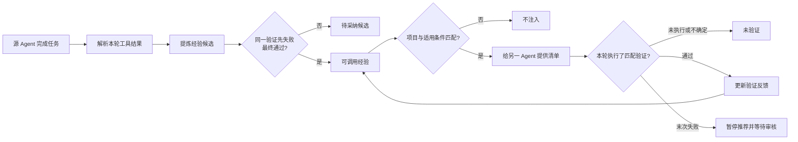

# MemWeave 经验学习闭环与界面优化

日期：2026-09-24。范围：本地 MemWeave Runtime、Claude Code / Codex adapters、管理页面。本文区分已实现行为、确定性测试、真实模型效果。

## 1. 这次要解决什么

过去有“知识保存了、能搜到、进入上下文”的记录，但这些并不能回答：上次踩过的坑是否被总结成可执行办法，换一个 Agent 能不能用，遇到反例后会不会继续传播。界面的长段统计又挤在左边，横向空间利用差，检索栏存在文字截断和字体不一致。

这次的实现重点是：**带适用条件、真实验证记录和反例暂停机制的跨 Agent 经验迁移**。这是本项目具体的工程设计与实现，不宣称首创算法，也不把“模型权重变聪明”作为已经完成的能力。

## 2. 截图方案的判断与取舍

| 建议 | 判断 | 本次落实 |
| --- | --- | --- |
| 从失败会话提炼教训 | 有价值，但失败并不能证明某个补救办法有效 | 提炼器输出结构化经验；代码校验本轮真实事件；同一验证命令先失败、最终通过才自动晋升；未恢复经验保留候选 |
| 程序性记忆 | 有价值，需要明确“记住步骤”与“强制执行”的边界 | 注入适用条件、检查清单、避免事项、验证命令；消费后观察是否执行相同验证，不强制接管 Agent 工具权限 |
| Runtime 自改进 | 应当先从可控反馈做起 | 同适用条件、同验证命令、同检索来源的经验之间，按验证记录有限重排；出现末次验证失败立即暂停推荐 |
| 宣称越用越聪明 | 目前证据不足以作整体效果承诺 | 展示输出、引用、验证、反例等分开的指标；保留任务成功率提升的后续实验入口 |

不采用全局自动改写系统提示词、不自动运行召回内容里的命令、不根据一次模型自评就宣告有效。这些选择是为了保持轻量和正常客户端体验，也避免把经验当成高权限指令。

## 3. 与参考方案的关系

Hermes 官方文档把 Skills 定位为按需加载的程序性知识，Agent 可以创建、更新技能，技能里可以记录步骤、坑点和验证方式。[1] Reflexion 通过反馈后的语言反思和情景记忆影响后续尝试，不需要更新模型权重。[2] 因此，“保存步骤”和“总结失败”本身不能作为我们的原创点。

本项目选择把这些思想组合成一个更窄、可测的本地工程闭环：

- 共享的是带约束的经验记录，保留来源 Agent、项目、会话与证据。
- 经验生效需要准入证据；匹配时还要满足适用条件。
- 验证观察关联到消费轮次，区分已输出、已引用、检查通过。
- 后续出现反例可以暂停既有经验，不让历史成功数抵消当前失败。
- 经验与既有 LFHV 治理共同工作：LFHV 检查退役知识是否仍有需求，经验闭环检查正在使用的办法是否仍适用。

这里的差异是我们的实现边界与证据设计，不意味着 Hermes 或其他框架完全没有相似能力，也没有完成所有开源框架的排他性查新。

## 4. 一条经验如何产生、迁移与退出



### 4.1 经验契约

沿用 `procedure` 类型，不再新增一套知识类型。内容保存为规范 JSON，显示和注入时转成可读清单。字段有长度及数量限制，整体上限为 6000 字符。

```json
{
  "experience": {
    "version": 1,
    "applies_when": ["widget", "Windows"],
    "exclude_when": ["Linux"],
    "steps": ["先读取字段定义", "按约定字段顺序输出，再执行验证"],
    "avoid": ["不要把字段顺序当成无关信息"],
    "reason": "源轮次观察到字段顺序检查先失败，调整后相同检查通过。",
    "verifier": {
      "kind": "observed_command",
      "command": "python -m pytest tests/test_widget.py -q"
    }
  }
}
```

此处为说明和测试用例，不代表真实用户库中已经存在该经验。

### 4.2 准入

模型只能提出候选；代码负责验证结构、凭据检查和证据引用。验证命令必须在本轮真实的 test/command 事件中出现，事件必须属于当前 Agent、项目及会话。适用词与排除词也必须在源材料中出现，不能凭空添加环境条件。

晋升为 `active` 需要引用一次失败及其后的成功，并检查所有本轮匹配事件的最终结果。不能只挑中间成功、隐藏后续失败。只有成功、未解决失败、结果未知，都不足以自动晋升。被暂停的经验也不会因为再次提炼出相同内容而自动恢复。

“源材料出现条件词”只是最低限度的事实约束，不等于验证了模型对条件的语义解释；“先失败后成功”只证明观察到恢复，不证明经验中每个步骤都导致恢复。

### 4.3 召回与程序性内容

候选生成、bridge、sibling、anchor，以及最终上下文输出均有适用性过滤。条件是 AND，任意排除条件命中即不注入；英文按词或标识边界匹配，中文按子串匹配。不通过条件的经验不会因为关键词得分高而插进来。

结构化内容变为“适用条件 → 不适用 → 教训 → 执行清单 → 避免事项 → 完成后验证”。本版仍是建议式上下文；它不保证 Agent 必然照做。没有执行对应检查，就记录未验证，不用点击或引用次数冒充使用收益。

### 4.4 反馈与暂停

轮次结束后，匹配相同验证命令的真实结果：

| 观察 | 行为 |
| --- | --- |
| 最终通过、前面没有失败 | passed |
| 先失败、最终通过 | recovered，同时记录失败观察 |
| 最终失败 | failed，active/stale 经验转 quarantined，停止正常推荐 |
| 没执行、末次结果未知、轮次关联不足 | 未验证，不增加通过数 |

暂停表示“需要复核”，不代表已经证明经验本身错误；环境波动、任务差异也可能引起失败。可通过已有审核流程恢复，历史证据保留。

聚合数据放在 `experience_outcomes`，每条经验一行，与原知识记录关联。trace 完成、计数更新和暂停在同一事务中完成；重复或并发完成同一 trace 不重复计数。每条知识保留最多 50 条相关生命周期审计记录。

### 4.5 反馈影响排序

仅在适用词、排除词、验证命令、状态、项目、作用域、origin 完全相同的经验组内比较：

`score = (passed + 1) / (passed + failed + 2)`

跨 Agent 验证次数作为有限的同分排序依据，最多计入 3 次。不改变普通记录占据的位置，不让 sibling 越过 direct；有界候选只做一次按 ID 的 SQL 读取。这个得分是平滑排序启发式，不是校准过的成功概率，更不是强化学习训练。

## 5. 真实客户端对接补强

### 5.1 轮次关联

Codex 沿用其 Hook `turn_id`。官方文档说明了这一轮次字段。[3] Claude Code 文档提供 `prompt_id`，并说明 transcript 异步写入，Hook 触发时文件可能滞后。[4]

实现优先使用已提供的轮次 ID；Claude 的 `prompt_id` 映射成内部轮次键，旧版使用 transcript 的用户消息 UUID。提交时额外保存文件边界：当前消息已经落盘就要求结束时为同一 UUID；尚未落盘就要求结束时为紧接该边界的下一条用户消息。同时核对 prompt。重复提示、晚到的 Stop、跳过中间轮次和多条匹配都不能冒领验证结果。

提交路径只读最多 64 KiB 尾部来检查边界；结束解析最多 2 MB。文件缺失、超出窗口或关联不清时保守不计通过。完整会话不会新增存入经验表，边界保存的是摘要标识。

### 5.2 工具结果

显式非零退出码、错误或中断优先判失败。不能因为存在 `stderr` 字段、外层显示 `Script completed` 就判断内部命令通过；后台仍运行或退出码未知也不能算通过。

Codex 普通命令工具可直接解析。对于 `exec` 包装，仅解析两种可明确一一对应的单调用字面量形态，从内层 JSON 获取退出码，不执行 JavaScript。动态拼接命令、批量调用、复杂包装和缺失退出结果保持未验证。这是有意保留的能力边界，不伪造覆盖率。

本轮没有要求用户换客户端，也没有把内部知识 ID 加回用户回答。

## 6. 页面调整与指标口径

原“实际复用证据”改为四等宽卡：上下文输出、跨 Agent 引用、产物校验、检索延迟 P50。下方增加经验学习四卡：可调用经验、跨 Agent 验证、失败检查观察、反例暂停。真实没有样本时显示 0 或“暂无样本”。

检索栏移除 `/` 徽标，占位改为完整显示的“搜索知识或来源”。输入、日期及选择框的字体、字号、字重统一，减少杂色；较窄桌面窗口允许合理换行而不是挤出横向滚动条。原有筛选、时间箭头、重置和键盘操作保留。整体页面结构与白色风格延续。

计数含义必须一起看：

- 输出条次：经验或知识进入了 Hook 返回的上下文，不保证模型实际采纳。
- 引用/来源标注：回答出现了相关标注，不保证产物符合要求。
- 跨 Agent 验证条次：不同来源 Agent 的经验已输出，并在关联轮次观察到匹配验证通过；不是因果收益。
- 失败检查观察：匹配检查失败的记录；同一命令可能对应多条经验，不是独立任务失败数。
- 反例暂停：当前 quarantined 的经验条数，是状态存量。
- P50/P95：本地检索测量，不是完整 Hook 耗时，也不是模型首 token 时间。

## 7. 本轮验收记录

报告目录：`outputs/experience-loop-20260924/`。

| 检查 | 结果 | 能说明什么 |
| --- | --- | --- |
| 全量 pytest | 248 passed，9 subtests passed；27.32 秒 | 本轮功能、旧功能及边界测试通过 |
| 经验循环集成 | 100/100；20 组场景，双向各 10 组；100 次真实验证子进程 | 准入、迁移、隔离、未验证和反例暂停链路成立 |
| JSONL 与 Runtime | 真实格式输入，双向学习与反馈；重复/错轮次/工具结果边界测试通过 | adapters 与 HTTP 传输没有只停留在手工构造 Turn 层 |
| 普通知识回归 | 100 条标准查询 + 60 条本地快照查询，各 3 次 | 顺序、origin、related_to 和注入记录差异均为 0；无意外上下文差异 |
| 桌面页面 | 1920/1440/1280/1100/1000 宽度通过，浏览器 JS 错误 0 | 占位文字完整、无横向溢出、卡片等宽、字体一致 |
| Runtime | 健康检查通过；端口和凭据保持；源码版本一致 | 本机服务已加载本轮代码 |

全量测试日志：`pytest.txt`。集成结果：`integration-100.json`。浏览器记录：`ui/report.json`。真实页面截图：`ui/evidence-1440.png`、`ui/filters-1440.png`。`evidence-fixture.png` 是浏览器拦截模拟数据，仅用于排版测试，不能拿来宣称用户的真实使用量。

100 项集成检查由 **20 个底层场景各派生 5 个检查**，并非 100 个独立真实用户任务。固定脚本提炼器和消费方在不读经验时 20 次失败、读经验后 20 次通过；这证明测试设计中的信息传递，不代表 LLM 从 0% 提升到 100%。所有测试数据在临时数据库中，未写入真实知识库。服务更新时真实经验计数为 0。

普通知识回归对照的是“四层检索重构前”的固定 oracle；允许的上下文变化只有已在上轮文档说明的 sibling 父标题补全。本轮最终报告中的本地快照热检索 P50 为 10.896 ms，P95 为 15.993 ms，最大 19.442 ms。不同测量批次存在机器负载差异，不应挑选最小值当承诺。

另做同一当前流水线开关经验门禁/反馈排序的 30 次交替热查询：100 条普通记录 P50 为 2.212 → 2.274 ms；100 条结构化经验为 2.250 → 4.043 ms，见 `experience-cost.json`。这是检索局部增量，不包括此次增加的 transcript 边界读取、进程启动、网络或模型延迟。

## 8. 实现位置

| 文件 | 职责 |
| --- | --- |
| `src/agent_knowledge_bridge/experiences.py` | 契约校验、适用门禁、准入判断、结果观察、反馈计数、等价组排序 |
| `claude_learning_adapter.py`、`codex_learning_adapter.py` | 提炼入口、来源核对、经验发布、轮次关联、双向共用学习逻辑 |
| `claude_transcript.py`、`codex_transcript.py` | 本轮解析、退出结果识别、Claude 文件边界、Codex 单命令包装 |
| `store.py`、`retrieval_pipeline.py` | 表结构、各路过滤、仲裁重排 |
| `reuse.py` | 经验清单输出、trace、事务性观察与反例暂停 |
| `learning.py` | 聚合指标 |
| `compiler.py` | 编译身份版本 `memweave-compiler-v2-experience` |
| `contracts.py`、`runtime_client.py`、`scripts/*_learning_hook.py` | transcript_path 和轮次信息传输 |
| `knowledge_dashboard.html` | 统计卡片、搜索栏、经验详情与验证显示 |
| `tests/test_experiences.py`、`tests/test_experience_transcripts.py` | 经验边界与真实格式适配测试 |
| `scripts/evaluate_experience_loop.py` | 100 项确定性集成实验 |
| `scripts/benchmark_experience_cost.py` | 新增检索机制的开关对照 |
| `scripts/qa_experience_ui.cjs` | 桌面布局和交互 QA |

Core 新增逻辑只使用 Python 标准库和既有 SQLite；未新增向量服务、重排模型或在线模型调用。经验提炼沿用结束后的 reviewer；本轮自动化测试未发起付费模型请求。

## 9. 怎么实际体验，下一步怎么证明价值

正常使用已有 Claude Code / Codex 入口即可。先在同一项目完成一个有真实失败与修复的任务，执行项目本来就需要的验证；结束后查看是否产生 procedure 经验，以及它的适用条件、失败和成功证据。只有聊天说“修好了”，不会凭空生成验证通过记录。

再让另一 Agent 做符合适用条件的同类任务。看 trace 中是否输出经验、是否执行匹配检查及结果。如果没有经验，不为了填满卡片补造测试记录；先检查候选、提炼运行状态、作用域与条件匹配。含排除词的提示会保守拒绝，例如即便用户说“不是 Linux”，本版字符串门禁仍会看到 Linux 并拒绝；这类误拒绝是当前需要收集的真实样本。

证明任务收益还需要独立实验：固定模型和版本、固定工具与预算，将源任务和保留的目标任务分开，比较 memory off、当前经验、人工正确经验三组；随机化顺序并重复执行。至少记录任务成功率、同类错误复发率、误注入率、匹配检查执行率、总 token、端到端耗时和首 token 增量。脚本完成率不能替代这些结果。

当前限制包括：条件匹配是词面规则；严格同命令不能识别等价命令；没有验证脚本内容哈希或环境指纹；代码只核查恢复证据，不能证明提炼步骤的因果关系；复杂 Codex 包装和异步落盘极端情况可能漏记；候选经验继续服从已有治理策略。暂停经验应由人结合反例判断是范围问题、环境问题还是错误办法。

## 10. 一手参考

以下页面于 2026-09-24 核对；仅作为方案背景，不作为本地工程已实现能力的证据。

1. Hermes 官方 Working with Skills：`https://hermes-agent.nousresearch.com/docs/guides/work-with-skills`。
2. Shinn 等，Reflexion: Language Agents with Verbal Reinforcement Learning，2023：`https://arxiv.org/abs/2303.11366`。
3. OpenAI 官方 Hooks：`https://learn.chatgpt.com/docs/hooks`，由官方 developers 文档跳转；UserPromptSubmit / Stop 的 turn_id 字段。
4. Claude Code 官方 Hooks reference：`https://code.claude.com/docs/en/hooks`；Common input fields 中的 prompt_id 和异步 transcript 说明。
